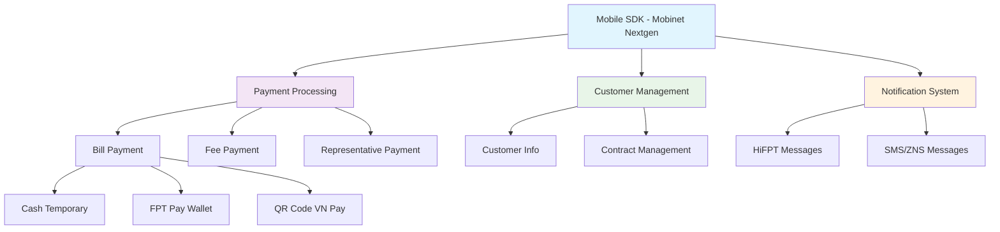
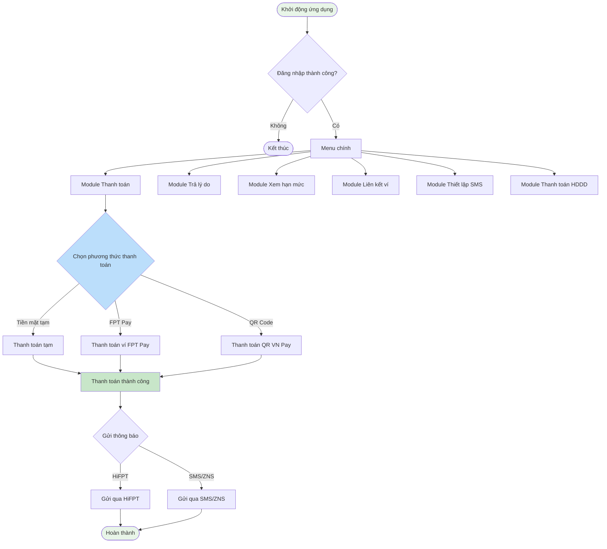

# Mobinet Nextgen Ver 2.0 - Master Analysis Overview

## Thông tin dự án | Project Information

**Tên dự án:** Mobinet Nextgen VER 2.0  
**Loại tài liệu:** URD - User Requirements Document  
**Mã hiệu:** 1.0-BM/PM/HDCV/FTEL  
**Phiên bản:** 1.1  
**Ngày:** 18/7/2025  
**Tác giả:** ThaoNTH9  
**Người duyệt:** GiauTQ  

## Tổng quan hệ thống | System Overview

### Mục đích dự án | Project Purpose
Xây dựng SDK thanh toán hóa đơn và khoản thu phục vụ cho:
- **Nhân viên Sale**: Hỗ trợ thanh toán cho khách hàng
- **TIN/PNC**: Nhân viên kỹ thuật
- **Thu cước**: Nhân viên thu cước

### Domain nghiệp vụ | Business Domain
Thanh toán hóa đơn và khoản thu của khách hàng thông qua ứng dụng di động.

## Sơ đồ tổng quan hệ thống | System Architecture Overview

## Danh sách các module chức năng | Functional Modules

| STT | Tên Module | Loại | Mô tả chức năng |
|-----|------------|------|----------------|
| 1 | [**Thanh toán**](./MobinetNextgen_Payment_Analysis.md) | Upgrade | Thanh toán hóa đơn và khoản thu với nhiều phương thức |
| 2 | [**Trả lý do không thanh toán**](./MobinetNextgen_NonPaymentReason_Analysis.md) | Upgrade | Cập nhật nguyên nhân và lịch hẹn thanh toán |
| 3 | [**Xem hạn mức thanh toán**](./MobinetNextgen_PaymentLimit_Analysis.md) | Upgrade | Quản lý và xem hạn mức thanh toán tạm |
| 4 | [**Liên kết ví/Ngân hàng**](./MobinetNextgen_WalletBanking_Analysis.md) | Upgrade | Liên kết và quản lý phương thức thanh toán |
| 5 | [**Thiết lập gửi tin nhắn**](./MobinetNextgen_SMSSetup_Analysis.md) | Upgrade | Cấu hình kênh gửi thông báo thanh toán |
| 6 | [**Thanh toán hợp đồng đại diện**](./MobinetNextgen_RepresentativePayment_Analysis.md) | Upgrade | Thanh toán nhiều hợp đồng cùng lúc |

## Sơ đồ luồng nghiệp vụ tổng quan | Overall Business Process Flow

## Actors và quyền truy cập | Actors and Access Rights

### TIN/PNC (Nhân viên Kỹ thuật)
- **Quyền:** Thanh toán hóa đơn, xem hạn mức, liên kết ví, thiết lập SMS
- **Giới hạn:** Bắt buộc thanh toán khoản thu từ PTC
- **Hạn mức:** Được cấp HMBS (Hạn mức bổ sung) khi đủ điều kiện

### Thu cước (Nhân viên Thu cước) 
- **Quyền:** Tất cả chức năng, trả lý do không thanh toán
- **Giới hạn:** 10 lần gửi SMS/ZNS mỗi tháng cho mỗi số điện thoại
- **Đặc biệt:** Tự động check chọn hóa đơn "Bình thường"

### Sale (Nhân viên Bán hàng)
- **Quyền:** Thanh toán cơ bản, liên kết ví
- **Giới hạn:** Theo policy công ty

## Tích hợp hệ thống | System Integrations

### Hệ thống nội bộ
- **Tool Liệt kê cước:** Lấy thông tin hóa đơn và chi tiết dịch vụ
- **Tool Đối soát khoản thu:** Quản lý thông tin khoản thu
- **Tool Chăm sóc khách hàng:** Cập nhật thông tin care khách hàng
- **Tool Quản lý Công nợ DVKH:** Quản lý nợ và lịch hẹn thanh toán

### Hệ thống thanh toán
- **FPT Pay:** Ví điện tử nội bộ FPT
- **VN Pay:** Cổng thanh toán QR Code quốc gia
- **Foxpay:** Gateway thanh toán FPT Pay

### Hệ thống thông báo
- **HiFPT:** Ứng dụng khách hàng FPT
- **Zalo Business:** Zalo Notification Service
- **SMS Gateway:** Hệ thống gửi tin nhắn

## Yêu cầu kỹ thuật tổng quan | Technical Requirements Overview

### Yêu cầu về bảo mật
- Xác thực OTP cho giao dịch > 5 triệu VNĐ
- Mã hóa thông tin thanh toán
- Xác thực người dùng qua mã nhân viên

### Yêu cauvel hiệu suất
- Thời gian phản hồi < 3 giây cho thanh toán
- Hỗ trợ thanh toán đồng thời nhiều giao dịch
- Đồng bộ real-time với các hệ thống backend

### Yêu cầu về giao diện
- Responsive design cho mobile
- Hỗ trợ tiếng Việt
- Wireframe tham khảo: [Figma Design](https://www.figma.com/design/Ex8yecMU7ZfmHpYurQQRwW/MBX...)

## Kết luận và khuyến nghị | Conclusions and Recommendations

### Điểm mạnh của hệ thống
1. **Tích hợp toàn diện:** Kết nối nhiều phương thức thanh toán
2. **Linh hoạt:** Hỗ trợ nhiều loại nhân viên với quyền khác nhau
3. **Thông minh:** Tự động hóa nhiều quy trình nghiệp vụ

### Khuyến nghị triển khai
1. **Giai đoạn 1:** Triển khai module Thanh toán cơ bản
2. **Giai đoạn 2:** Tích hợp các module hỗ trợ (SMS, Wallet)
3. **Giai đoạn 3:** Triển khai module HDDD và tối ưu hóa

### Rủi ro cần quan tâm
- **Bảo mật giao dịch:** Cần kiểm tra kỹ các luồng xác thực
- **Tích hợp:** Đảm bảo tính ổn định khi kết nối nhiều hệ thống
- **Hiệu suất:** Xử lý đồng thời nhiều giao dịch trong giờ cao điểm

---

**Lưu ý:** Tài liệu này là phân tích tổng quan. Vui lòng tham khảo các file module chi tiết để có thông tin đầy đủ về từng chức năng.