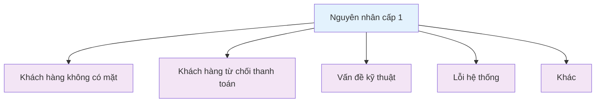
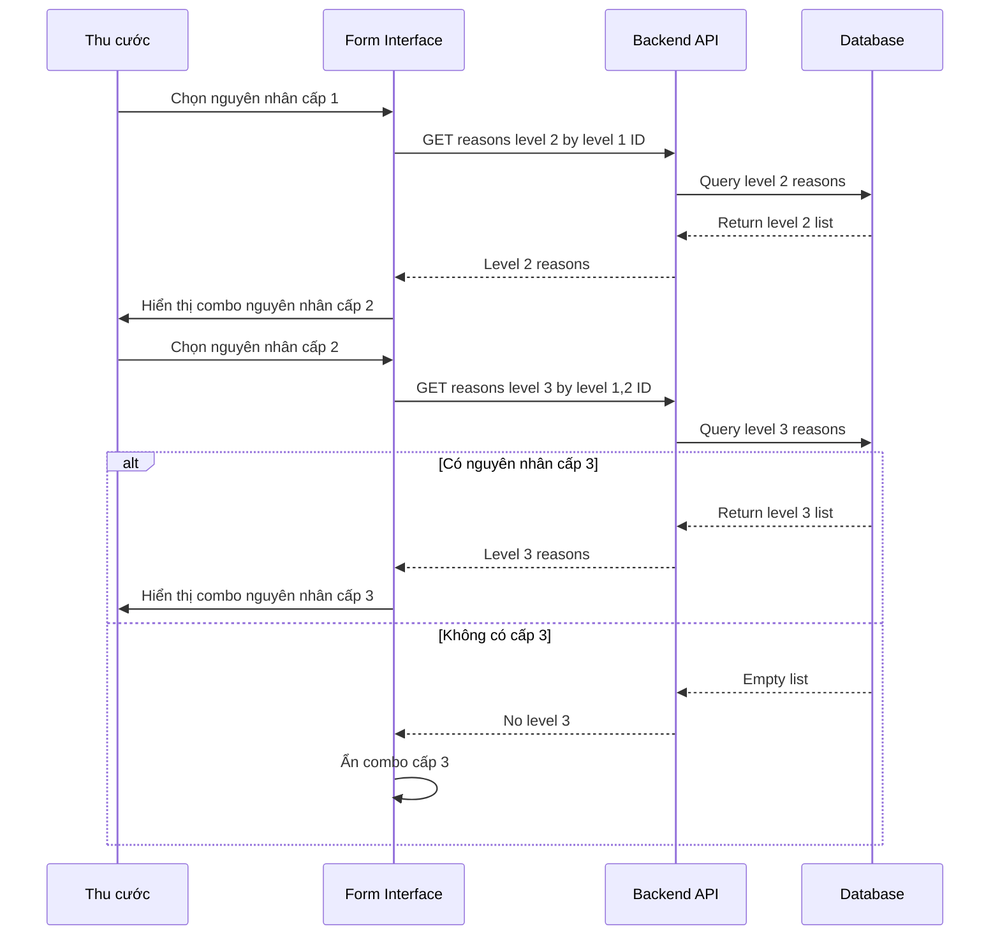
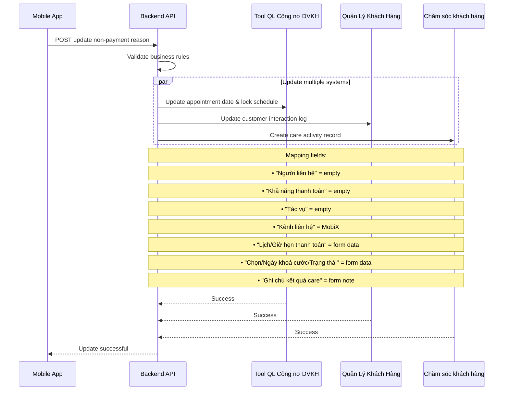
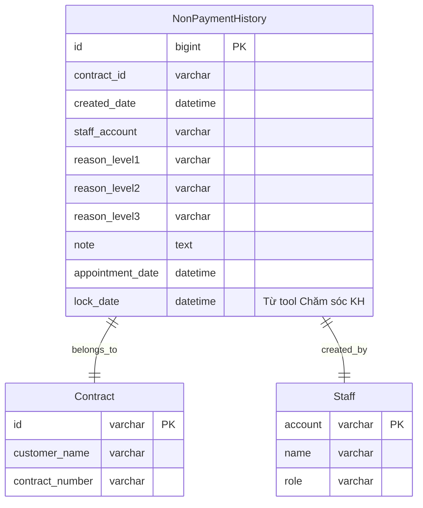

# Module Trả lý do không thanh toán - Non-Payment Reason Analysis

**[⬅️ Quay lại Master Analysis](./MobinetNextgen_Master_Analysis.md)**

## Thông tin module | Module Information

- **Tên module:** Trả lý do không thanh toán (Non-Payment Reason)
- **Loại:** Upgrade
- **Mô tả:** Cập nhật lý do không thanh toán, ngày hẹn thanh toán và ngày dự kiến khóa cước
- **Actors:** Thu cước
- **Trigger:** Nhấn "..." tại màn hình Thanh toán → Cập nhật trả lý do không thanh toán
- **Priority:** High - Essential for debt collection workflow

## Sơ đồ luồng nghiệp vụ | Business Process Flow

```mermaid
flowchart TD
    Start([Nhấn "..." tại màn hình thanh toán]) --> OpenForm[Mở màn hình trả lý do]
    OpenForm --> LoadReasons[Load danh sách nguyên nhân]
    LoadReasons --> ShowForm[Hiển thị form nhập thông tin]
    
    ShowForm --> SelectReason1{Chọn nguyên nhân cấp 1}
    SelectReason1 --> LoadReason2[Load nguyên nhân cấp 2]
    LoadReason2 --> SelectReason2{Chọn nguyên nhân cấp 2}
    SelectReason2 --> CheckReason3{Có nguyên nhân cấp 3?}
    
    CheckReason3 -->|Có| ShowReason3[Hiển thị combo cấp 3]
    CheckReason3 -->|Không| SkipReason3[Bỏ qua cấp 3]
    
    ShowReason3 --> SelectReason3[Chọn nguyên nhân cấp 3]
    SelectReason3 --> EnterNote[Nhập ghi chú]
    SkipReason3 --> EnterNote
    
    EnterNote --> SetAppointment[Chọn ngày hẹn thanh toán]
    SetAppointment --> CheckUserType{User = Thu cước?}
    
    CheckUserType -->|Có| ShowLockDate[Hiển thị ngày dự kiến khóa cước]
    CheckUserType -->|Không| SkipLockDate[Bỏ qua khóa cước]
    
    ShowLockDate --> SetLockDate[Thiết lập lịch khóa cước]
    SetLockDate --> ValidateForm[Validate toàn bộ form]
    SkipLockDate --> ValidateForm
    
    ValidateForm --> CheckValid{Form hợp lệ?}
    CheckValid -->|Không| ShowError[Hiển thị lỗi validation]
    CheckValid -->|Có| SaveData[Lưu thông tin]
    
    ShowError --> ShowForm
    SaveData --> UpdateCareSystem[Cập nhật hệ thống chăm sóc KH]
    UpdateCareSystem --> ShowHistory[Hiển thị lịch sử cập nhật]
    ShowHistory --> End([Hoàn thành])
    
    style Start fill:#e8f5e8
    style End fill:#e8f5e8
    style ValidateForm fill:#bbdefb
    style SaveData fill:#c8e6c9
    style ShowError fill:#ffcdd2
```

## Cấu trúc dữ liệu form | Form Data Structure

### Nguyên nhân cấp 1 (Level 1 Reasons)


### Logic cascade nguyên nhân | Reason Cascade Logic


## Chi tiết các trường dữ liệu | Field Specifications

### 1. Nguyên nhân cấp 1 (Mandatory)
- **Type:** Dropdown/ComboBox
- **Validation:** Bắt buộc chọn
- **Error message:** "Vui lòng nhập đầy đủ thông tin"
- **Behavior:** Load từ database, single selection

### 2. Nguyên nhân cấp 2 (Mandatory)  
- **Type:** Dropdown/ComboBox
- **Validation:** Bắt buộc chọn
- **Dependency:** Phụ thuộc vào nguyên nhân cấp 1
- **Auto-refresh:** Khi thay đổi cấp 1

### 3. Nguyên nhân cấp 3 (Conditional)
- **Type:** Dropdown/ComboBox
- **Visibility:** Ẩn mặc định, hiện khi có data
- **Dependency:** Phụ thuộc vào cấp 1 + cấp 2
- **Validation:** Bắt buộc nếu hiển thị

### 4. Ghi chú (Mandatory)
- **Type:** TextArea
- **Max length:** 500 ký tự
- **Validation:** Bắt buộc nhập
- **Placeholder:** "Nhập ghi chú chi tiết lý do không thanh toán..."

### 5. Ngày hẹn thanh toán (Mandatory)
- **Type:** DateTime Picker
- **Date range:** Từ ngày hiện tại trở về sau
- **Time:** Picker giờ và phút
- **Validation:** Không chọn ngày quá khứ

### 6. Ngày dự kiến khóa cước (Thu cước only)

```mermaid
flowchart TD
    ShowField{Hiển thị đối với Thu cước}
    ShowField --> Frame1[Khung đầu tiên: Chọn mục khóa]
    
    Frame1 --> CheckSelection{Chọn gì?}
    CheckSelection -->|Không chọn| HideAll[Ẩn khung 2,3]
    CheckSelection -->|"Mục 2: Khóa sau mục 1..."| ShowFrame2[Hiển thị khung thứ 2]
    
    ShowFrame2 --> Frame2Options{Lựa chọn khung 2}
    Frame2Options -->|"Hủy lịch khóa"| HideFrame3[Ẩn khung 3]
    Frame2Options -->|Chọn ngày| ValidateDate{Ngày hợp lệ?}
    
    ValidateDate -->|Từ ngày 13 đến cuối tháng| ShowFrame3[Hiển thị khung 3]
    ValidateDate -->|Không hợp lệ| ShowError[Lỗi: "Chỉ cho phép từ ngày 13..."]
    
    ShowFrame3 --> Frame3[Chọn trạng thái: Duy trì/Tạm thời]
    Frame3 --> Complete[Hoàn tất thiết lập]
    
    style ShowField fill:#e3f2fd
    style ValidateDate fill:#fff3e0
    style ShowError fill:#ffcdd2
    style Complete fill:#c8e6c9
```

## Business Rules chi tiết | Detailed Business Rules

### BR.2.1 - Validation Rules

#### Form Validation
```javascript
// Pseudo validation logic
validateForm() {
    errors = []
    
    if (!reason1Selected) {
        errors.push("Vui lòng nhập đầy đủ thông tin - Nguyên nhân cấp 1")
    }
    
    if (!reason2Selected) {
        errors.push("Vui lòng nhập đầy đủ thông tin - Nguyên nhân cấp 2") 
    }
    
    if (reason3Visible && !reason3Selected) {
        errors.push("Vui lòng nhập đầy đủ thông tin - Nguyên nhân cấp 3")
    }
    
    if (note.trim().length == 0) {
        errors.push("Vui lòng nhập đầy đủ thông tin - Ghi chú")
    }
    
    if (appointmentDate < currentDate) {
        errors.push("Không thể chọn ngày quá khứ")
    }
    
    return errors
}
```

#### Lock Date Validation
```javascript
validateLockDate() {
    if (userRole == "Thu cước") {
        if (lockDate < 13 || lockDate > endOfMonth) {
            return "Thao tác thất bại. Chỉ cho phép cập nhật lịch khóa từ ngày 13 đến cuối tháng và không cho phép chọn ngày khóa nhỏ hơn hoặc bằng ngày hiện tại."
        }
        
        if (lockDate <= currentDate) {
            return "Thao tác thất bại. Chỉ cho phép cập nhật lịch khóa từ ngày 13 đến cuối tháng và không cho phép chọn ngày khóa nhỏ hơn hoặc bằng ngày hiện tại."
        }
    }
    return null
}
```

### BR.2.2 - System Integration Rules

#### Customer Care System Update


## Lịch sử trả lý do | Non-Payment History

### Cấu trúc dữ liệu lịch sử


### Hiển thị lịch sử
- **Phạm vi:** Trong tháng hiện tại
- **Sắp xếp:** Mới nhất lên đầu
- **Thông tin hiển thị:**
  - Ngày trả lý do
  - Tài khoản trả lý do  
  - Nguyên nhân 1, 2, 3
  - Ghi chú
  - Ngày hẹn thanh toán (từ tool QL Công nợ)
  - Ngày dự kiến khóa cước (từ tool Chăm sóc KH)

## UI/UX Specifications

### Layout màn hình chính
```
┌─────────────────────────────────────┐
│ [←] Trả lý do không thanh toán      │
├─────────────────────────────────────┤
│ Nguyên nhân 1* [Dropdown ▼]        │
│ Nguyên nhân 2* [Dropdown ▼]        │
│ Nguyên nhân 3* [Dropdown ▼]        │ (Conditional)
│                                     │
│ Ghi chú*                           │
│ ┌─────────────────────────────────┐ │
│ │ [Text area for notes]           │ │
│ └─────────────────────────────────┘ │
│                                     │
│ Ngày hẹn thanh toán*               │
│ [Date picker] [Time picker]        │
│                                     │
│ Ngày dự kiến khóa cước             │ (Thu cước only)
│ ┌─────────────────────────────────┐ │
│ │ [Khóa cước options]             │ │
│ └─────────────────────────────────┘ │
│                                     │
│ [Lịch sử cập nhật ▼]               │
├─────────────────────────────────────┤
│           [Cập nhật]                │
└─────────────────────────────────────┘
```

### States và animations
- **Loading state:** Shimmer effect khi load nguyên nhân cấp 2,3
- **Error state:** Red border + error message dưới field lỗi
- **Success state:** Green checkmark + success message
- **Conditional visibility:** Smooth fade in/out cho nguyên nhân cấp 3

## Testing Scenarios | Kịch bản kiểm thử

### Test Case 1: Happy path - Thu cước cập nhật đầy đủ
```
Precondition: User là Thu cước, đã đăng nhập
Steps:
1. Từ màn hình thanh toán, nhấn "..."
2. Chọn nguyên nhân cấp 1: "Khách hàng không có mặt"
3. Chọn nguyên nhân cấp 2: "Đi công tác"
4. Nhập ghi chú: "Khách hàng đi công tác 1 tuần"
5. Chọn ngày hẹn: Ngày mai 9:00 AM
6. Chọn ngày khóa cước: Ngày 15 tháng này
7. Chọn trạng thái: "Duy trì"
8. Nhấn "Cập nhật"
Expected: Lưu thành công, hiển thị trong lịch sử
```

### Test Case 2: Validation errors
```
Precondition: User ở màn hình trả lý do
Steps:
1. Bỏ trống tất cả trường required
2. Nhấn "Cập nhật"
Expected: Hiển thị tất cả error messages validation
```

### Test Case 3: Lock date validation
```
Precondition: User là Thu cước
Steps:
1. Chọn ngày khóa cước < ngày 13 hoặc <= ngày hiện tại
2. Nhấn "Cập nhật"
Expected: "Thao tác thất bại. Chỉ cho phép cập nhật lịch khóa từ ngày 13..."
```

### Test Case 4: Cascade loading
```
Precondition: Có dữ liệu nguyên nhân 3 level
Steps:
1. Chọn nguyên nhân cấp 1 có cấp 2
2. Chọn nguyên nhân cấp 2 có cấp 3
Expected: Auto load và hiển thị combo nguyên nhân cấp 3
```

## Integration Points | Điểm tích hợp

### Internal Systems
- **Tool QL Công nợ DVKH/Quản Lý Khách Hàng:** Update appointment dates
- **Tool Chăm sóc khách hàng:** Store care activity records with mapping
- **Master Data Service:** Load reason hierarchies
- **User Service:** Validate user permissions

### Data Mapping for Care System
```yaml
care_record:
  người_liên_hệ: "" # Empty
  khả_năng_thanh_toán: "" # Empty  
  tác_vụ: "" # Empty
  kênh_liên_hệ: "MobiX" # Fixed value
  lịch_giờ_hẹn_thanh_toán: "${appointment_date} ${appointment_time}"
  ngày_khóa_cước: "${lock_date}"
  trạng_thái_khóa: "${lock_status}" # Duy trì/Tạm thời
  ghi_chú_kết_quả_care: "${user_note}"
```

## Performance Requirements | Yêu cầu hiệu suất

- **Response time:** < 2 seconds for reason cascade loading
- **Database queries:** Optimized with proper indexing on reason hierarchy
- **Caching:** Cache reason master data for 1 hour
- **Offline capability:** Store form data locally until connection restored

---

**[⬅️ Quay lại Master Analysis](./MobinetNextgen_Master_Analysis.md)**

**Liên quan:**
- [Module Thanh toán](./MobinetNextgen_Payment_Analysis.md)
- [Module Thiết lập gửi tin nhắn](./MobinetNextgen_SMSSetup_Analysis.md)