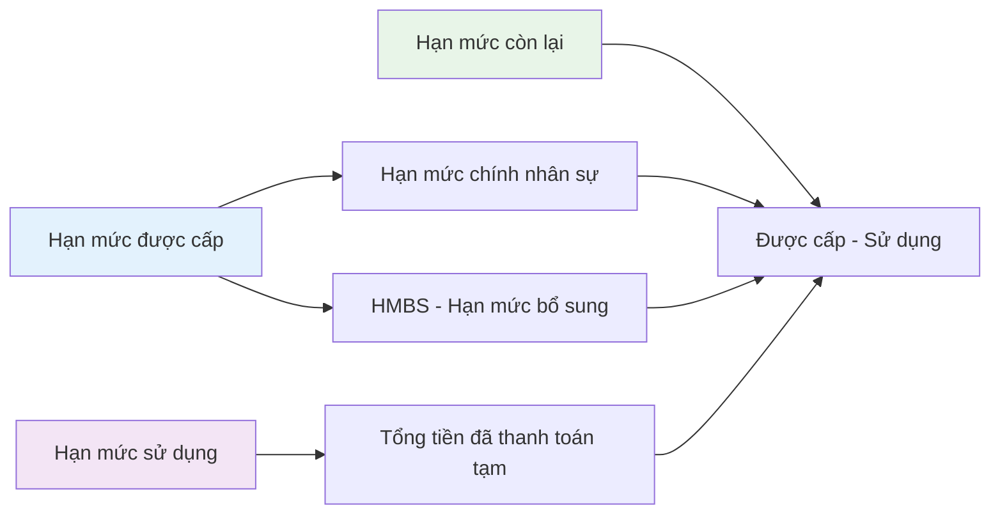
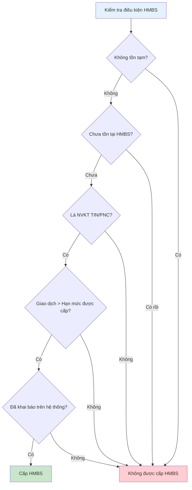
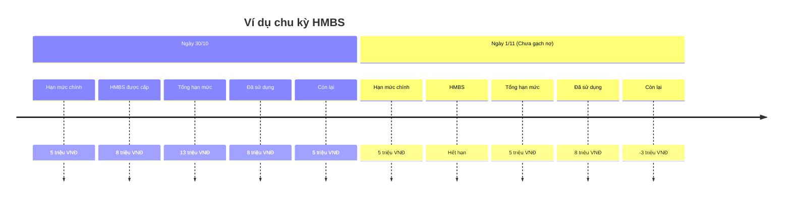
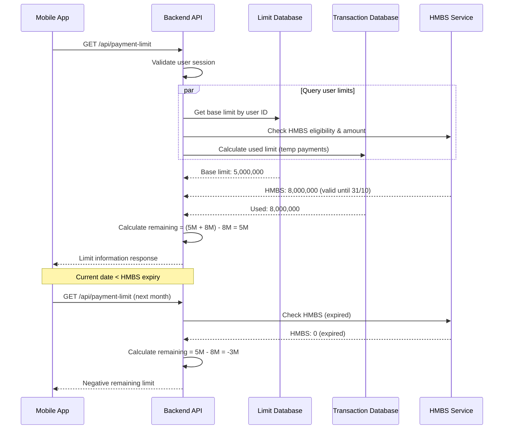
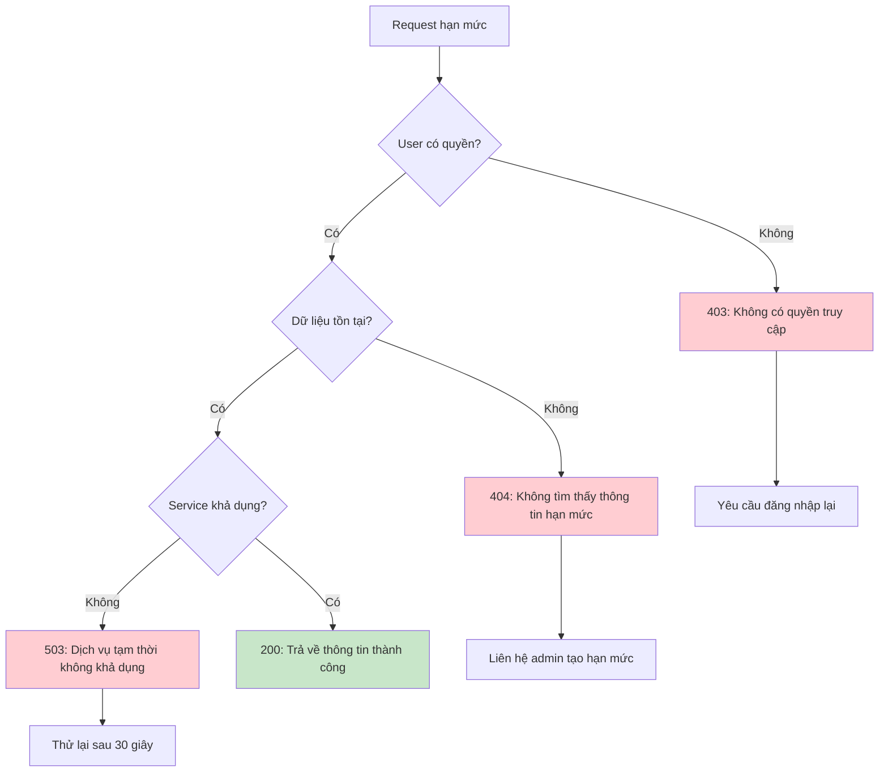
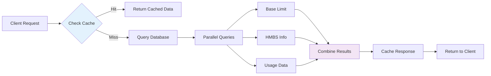

# Module Xem hạn mức thanh toán - Payment Limit Analysis

**[⬅️ Quay lại Master Analysis](./MobinetNextgen_Master_Analysis.md)**

## Thông tin module | Module Information

- **Tên module:** Xem hạn mức thanh toán (Payment Limit)
- **Loại:** Upgrade
- **Mô tả:** Cho phép người dùng xem hạn mức thanh toán tạm
- **Actors:** TIN/PNC, Thu cước
- **Trigger:** Nhấn xem hạn mức thanh toán
- **Priority:** Medium - Supporting function for payment decisions

## Sơ đồ luồng nghiệp vụ | Business Process Flow

```mermaid
flowchart TD
    Start([Nhấn "Xem hạn mức thanh toán"]) --> CheckAuth{Kiểm tra authentication}
    CheckAuth -->|Thất bại| AuthError[Lỗi xác thực]
    CheckAuth -->|Thành công| CheckRole{Kiểm tra role}
    
    CheckRole -->|TIN/PNC| TINFlow[Luồng TIN/PNC]
    CheckRole -->|Thu cước| CUSFlow[Luồng Thu cước]
    CheckRole -->|Khác| NoPermission[Không có quyền]
    
    TINFlow --> LoadTINLimit[Load hạn mức TIN/PNC]
    CUSFlow --> LoadCUSLimit[Load hạn mức Thu cước]
    
    LoadTINLimit --> CheckHMBS{Có HMBS không?}
    LoadCUSLimit --> CalculateLimit[Tính toán hạn mức]
    
    CheckHMBS -->|Có| CalculateWithHMBS[Tính với HMBS]
    CheckHMBS -->|Không| CalculateNormal[Tính hạn mức thường]
    
    CalculateWithHMBS --> DisplayInfo[Hiển thị thông tin hạn mức]
    CalculateNormal --> DisplayInfo
    CalculateLimit --> DisplayInfo
    
    DisplayInfo --> CheckUsage[Kiểm tra usage hiện tại]
    CheckUsage --> CalculateRemaining[Tính hạn mức còn lại]
    CalculateRemaining --> ShowDetails[Hiển thị chi tiết]
    ShowDetails --> End([Hoàn thành])
    
    AuthError --> End
    NoPermission --> End
    
    style Start fill:#e8f5e8
    style End fill:#e8f5e8
    style DisplayInfo fill:#bbdefb
    style CheckHMBS fill:#fff3e0
    style ShowDetails fill:#c8e6c9
```

## Cấu trúc dữ liệu hạn mức | Credit Limit Data Structure

### Thành phần hạn mức cơ bản


### Công thức tính toán
```
Hạn mức được cấp = Hạn mức chính nhân sự + HMBS (nếu có)
Hạn mức sử dụng = Tổng số tiền đã thanh toán tạm thành công  
Hạn mức còn lại = Hạn mức được cấp - Hạn mức sử dụng
```

## Logic HMBS (Hạn mức bổ sung) | Supplementary Credit Logic

### Điều kiện cấp HMBS


### Ví dụ tính toán HMBS


## API Specifications | Đặc tả API

### GET /api/payment-limit
```yaml
summary: Lấy thông tin hạn mức thanh toán
parameters:
  - name: userId
    type: string
    required: true
    description: Mã nhân viên
response:
  200:
    schema:
      type: object
      properties:
        success:
          type: boolean
        data:
          type: object
          properties:
            assigned_limit:
              type: number
              description: Hạn mức được cấp (bao gồm HMBS nếu có)
            used_limit:
              type: number  
              description: Hạn mức đã sử dụng
            remaining_limit:
              type: number
              description: Hạn mức còn lại
            base_limit:
              type: number
              description: Hạn mức chính nhân sự
            hmbs_limit:
              type: number
              description: HMBS (0 nếu không có)
            hmbs_valid_until:
              type: string
              format: date-time
              description: Thời hạn HMBS
            last_updated:
              type: string
              format: date-time
```

### Luồng xử lý API


## Business Rules chi tiết | Detailed Business Rules

### BR.3 - Quy tắc hiển thị hạn mức

#### Tính toán thành phần hạn mức
```javascript
// Pseudo code for limit calculation
calculatePaymentLimit(userId, currentDate) {
    // Get base limit for user
    baseLimit = LimitService.getBaseLimit(userId)
    
    // Check HMBS eligibility and amount
    hmbs = HMBSService.getActiveHMBS(userId, currentDate)
    hmdsAmount = hmbs ? hmbs.amount : 0
    
    // Calculate assigned limit
    assignedLimit = baseLimit + hmdsAmount
    
    // Get used limit from successful temp payments
    usedLimit = TransactionService.getTempPaymentSum(userId)
    
    // Calculate remaining
    remainingLimit = assignedLimit - usedLimit
    
    return {
        assigned: assignedLimit,
        used: usedLimit, 
        remaining: remainingLimit,
        base: baseLimit,
        hmbs: hmdsAmount
    }
}
```

#### HMBS Validation Rules
```javascript
validateHMBSEligibility(userId) {
    user = UserService.getUser(userId)
    
    // Must be TIN/PNC role
    if (!user.roles.includes('TIN') && !user.roles.includes('PNC')) {
        return false
    }
    
    // Must not have outstanding temp balance
    if (user.hasTempBalance()) {
        return false
    }
    
    // Must not have existing HMBS  
    if (HMBSService.hasActiveHMBS(userId)) {
        return false
    }
    
    // Transaction amount must exceed base limit
    if (requestAmount <= user.baseLimit) {
        return false
    }
    
    // Must be registered in limit system
    if (!LimitService.isRegisteredForHMBS(userId)) {
        return false  
    }
    
    return true
}
```

## UI/UX Specifications | Đặc tả giao diện

### Layout màn hình
```
┌─────────────────────────────────────┐
│ [←] Hạn mức thanh toán              │
├─────────────────────────────────────┤
│                                     │
│ 💳 Thông tin hạn mức                │
│                                     │
│ Hạn mức được cấp                    │
│ 13.000.000 đ                       │
│ ↳ Hạn mức chính: 5.000.000 đ       │
│ ↳ HMBS: 8.000.000 đ                │
│                                     │
│ Hạn mức sử dụng                     │  
│ 8.000.000 đ                        │
│                                     │
│ Hạn mức còn lại                     │
│ 5.000.000 đ                        │
│                                     │
│ ────────────────────────────────    │
│                                     │
│ ℹ️  Thông tin HMBS                  │
│ Có hiệu lực đến: 31/10/2025         │
│ Điều kiện: Nộp tiền trước 10h ngày  │
│ làm việc tiếp theo                  │
│                                     │
└─────────────────────────────────────┘
```

### States hiển thị

#### Normal State (Dương)
```css
.remaining-positive {
    color: #2e7d32; /* Green */
    font-size: 24px;
    font-weight: bold;
}
```

#### Warning State (Gần hết)
```css
.remaining-low {
    color: #f57c00; /* Orange */
    font-size: 24px;
    font-weight: bold;
}
/* Trigger when remaining < 10% of assigned */
```

#### Critical State (Âm)
```css
.remaining-negative {
    color: #d32f2f; /* Red */
    font-size: 24px;
    font-weight: bold;
}
```

### Responsive behavior
- **Mobile:** Single column layout, stack all info vertically
- **Tablet:** Two column layout for better space utilization  
- **Desktop:** Card-based layout with visual indicators

## Error Handling | Xử lý lỗi

### Lỗi thường gặp


### Error messages
```yaml
errors:
  403_FORBIDDEN: "Bạn không có quyền xem thông tin hạn mức thanh toán"
  404_NOT_FOUND: "Không tìm thấy thông tin hạn mức. Vui lòng liên hệ quản trị viên"
  503_SERVICE_UNAVAILABLE: "Dịch vụ hạn mức tạm thời không khả dụng. Vui lòng thử lại sau"
  NETWORK_ERROR: "Lỗi kết nối mạng. Vui lòng kiểm tra internet và thử lại"
  TIMEOUT: "Yêu cầu timeout. Vui lòng thử lại"
```

## Performance Requirements | Yêu cầu hiệu suất

### Response time targets
- **API response:** < 1 second for limit data
- **UI rendering:** < 500ms to display information
- **Refresh rate:** Manual refresh, auto-refresh every 5 minutes
- **Cache duration:** 2 minutes for limit data

### Optimization strategies


## Testing Scenarios | Kịch bản kiểm thử

### Test Case 1: Normal user with HMBS
```
Precondition: TIN user with active HMBS
Steps:
1. Open payment limit screen
2. Verify displayed information
Expected:
- Assigned limit = Base + HMBS
- Used limit = Sum of temp payments
- Remaining = Assigned - Used
- HMBS info visible with expiry date
```

### Test Case 2: Expired HMBS  
```
Precondition: User had HMBS but now expired
Steps:
1. Check limit after expiry date
Expected:
- Assigned limit = Base only (no HMBS)
- May show negative remaining if over-used
- HMBS section shows "Expired" or hidden
```

### Test Case 3: No permission
```
Precondition: User without TIN/PNC role  
Steps:
1. Try to access limit screen
Expected:
- 403 error or access denied message
- Redirect to login or main menu
```

### Test Case 4: Negative remaining limit
```
Precondition: User used more than current limit
Steps:
1. View limit information
Expected:
- Remaining shows negative value in red
- Warning message about exceeding limit
- Payment functionality may be disabled
```

## Integration Points | Điểm tích hợp

### Internal Systems
- **User Management:** Role validation, user information
- **Transaction Service:** Temporary payment history and totals  
- **Limit Management:** Base limit configuration per user
- **HMBS Service:** Supplementary limit calculation and expiry tracking

### External Dependencies
- **Database:** User limits, transaction history, HMBS records
- **Cache Layer:** Redis for performance optimization
- **Monitoring:** Track limit usage patterns and system health

---

**[⬅️ Quay lại Master Analysis](./MobinetNextgen_Master_Analysis.md)**

**Liên quan:**
- [Module Thanh toán](./MobinetNextgen_Payment_Analysis.md) - Sử dụng hạn mức để validation
- [Module Liên kết ví/Ngân hàng](./MobinetNextgen_WalletBanking_Analysis.md) - Alternative payment methods