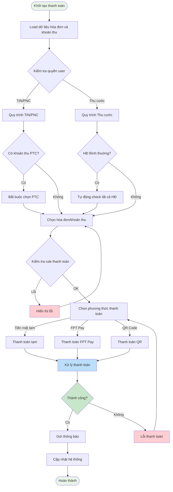
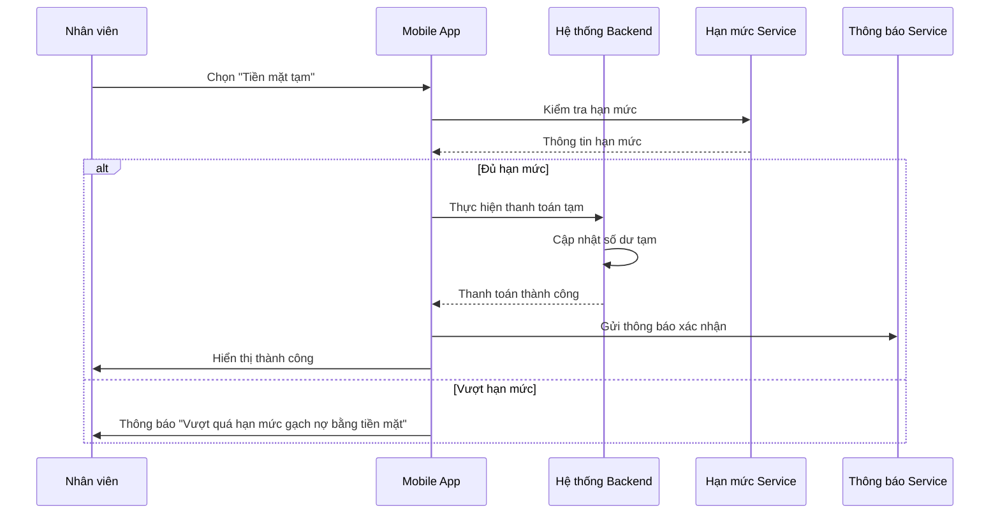
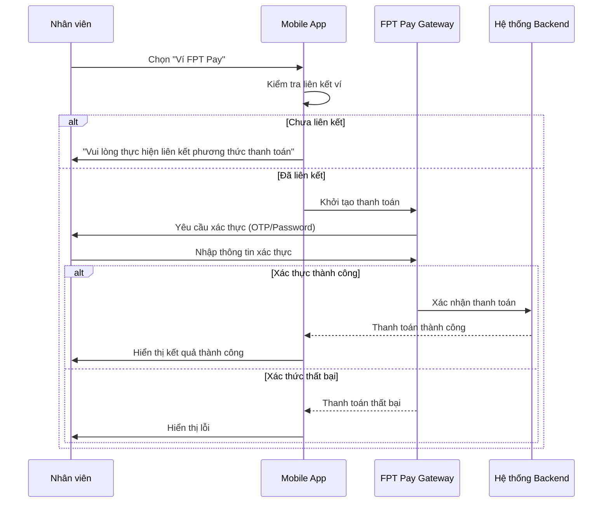
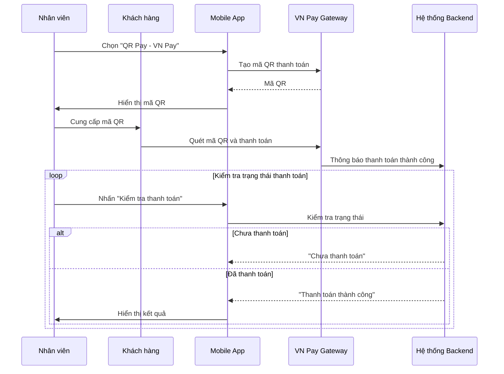
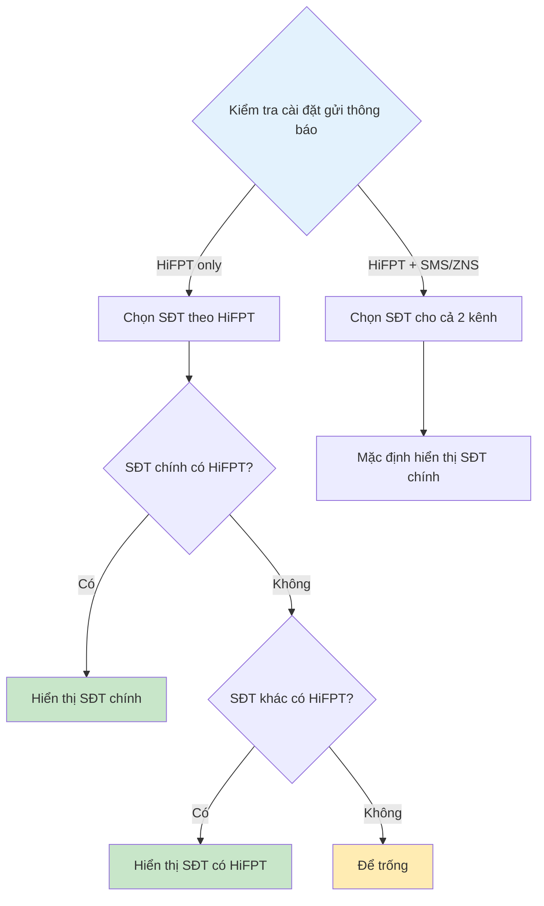
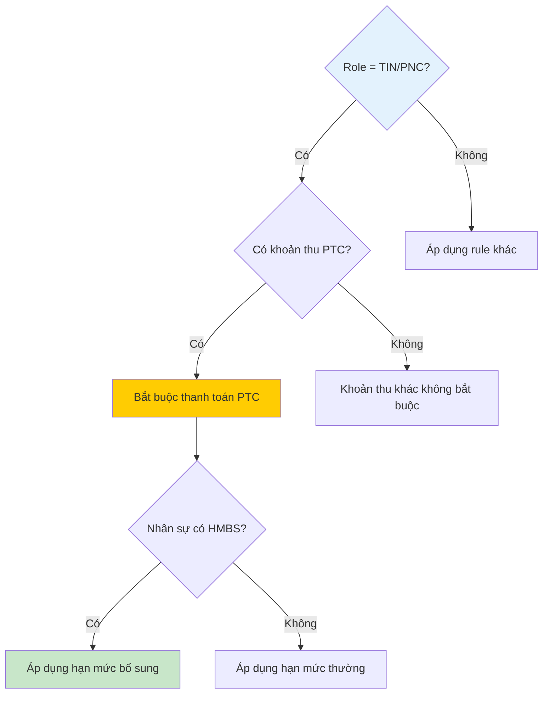
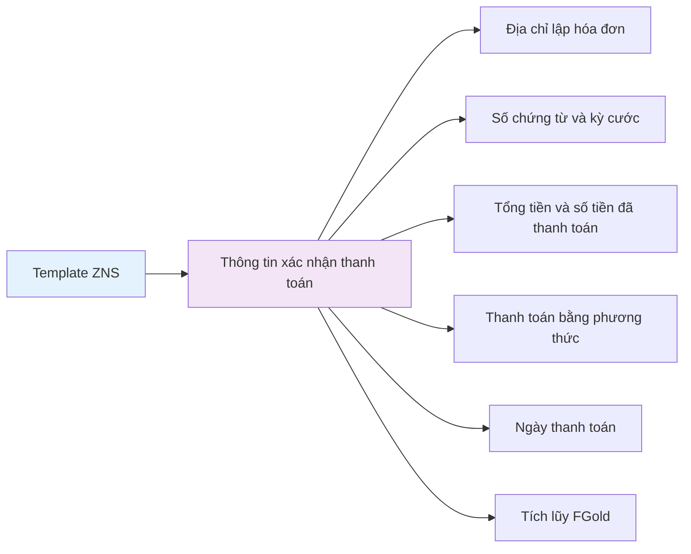

# Module Thanh toán - Payment Analysis

**[⬅️ Quay lại Master Analysis](./MobinetNextgen_Master_Analysis.md)**

## Thông tin module | Module Information

- **Tên module:** Thanh toán (Payment)
- **Loại:** Upgrade
- **Mô tả:** Chức năng thực hiện thanh toán khoản thu và hóa đơn
- **Actors:** TIN/PNC, Thu cước
- **Trigger:** Nhấn thanh toán
- **Priority:** Critical - Core business function

## Sơ đồ tổng quan luồng thanh toán | Payment Flow Overview



## Chi tiết các phương thức thanh toán | Payment Methods Details

### 1. Thanh toán tạm (Temporary Cash Payment)



### 2. Thanh toán FPT Pay



### 3. Thanh toán QR Code VN Pay



## Business Rules chi tiết | Detailed Business Rules

### BR.1 - Hiển thị thông tin thanh toán

#### Thông tin khách hàng
- **Hợp đồng:** Số hợp đồng khách hàng
- **Khách hàng:** Tên đầy đủ khách hàng
- **Số điện thoại:** Logic chọn SĐT phức tạp:



#### Danh sách hóa đơn
- **Số hóa đơn:** Mã định danh hóa đơn
- **Thời gian:** Từ ngày - Đến ngày (theo tool liệt kê cước)
- **Số tiền:** Giá trị hóa đơn bao gồm VAT
- **Nội dung:** Mô tả tổng hợp hóa đơn
- **Tích chọn:** Logic phức tạp theo role và trạng thái

#### Danh sách khoản thu
- **Nội dung:** Mô tả khoản thu
- **Số khoản thu:** Mã định danh
- **Số tiền:** Giá trị cần thu
- **Nguồn:** Loại trừ recare trả trước (PaidType = 2), titok, shopee
- **Tích chọn:** Theo quy tắc role cụ thể

### BR.2 - Rules thanh toán

#### Rule chung
1. **Thanh toán hóa đơn xa nhất trước**
   ```
   IF (Ngày phát hành HĐ được chọn > Ngày PH của HĐ chưa chọn)
   THEN Hiển thị: "Vui lòng thanh toán hóa đơn xa nhất"
   ```

2. **Tồn tạm chưa nộp tiền về công ty**
   ```
   IF (10h ngày hôm sau AND Tài khoản còn tồn tạm ngày hôm trước)
   THEN Không cho thanh toán: "Đang tồn tạm không thể thanh toán"
   ```

3. **Hạn mức thanh toán**
   ```
   IF (Hạn mức còn lại < Tổng tiền thanh toán)
   THEN Hiển thị: "Vượt quá hạn mức gạch nợ bằng tiền mặt"
   ```

4. **Giới hạn số lượng**
   ```
   IF (Số HĐ + Khoản thu được chọn > 6)
   THEN Hiển thị: "Chỉ được chọn tối đa 6 hóa đơn/khoản thu thanh toán"
   ```

#### Rule theo role TIN/PNC


#### Rule theo role Thu cước
```mermaid
flowchart TD
    CheckContract{Loại hợp đồng?}
    CheckContract -->|Bình thường| CheckSR{Có SR KPDV "đang xử lý"?}
    CheckContract -->|Khác Bình thường| CheckSRSpecial{Có SR KPDV "đang xử lý"?}
    
    CheckSR -->|Có| ForcePayBill[Bắt buộc thanh toán HĐ]
    CheckSR -->|Không| OptionalBill[Không bắt buộc thanh toán HĐ]
    
    CheckSRSpecial -->|Không| ForcePayBill
    CheckSRSpecial -->|Có| OptionalBill
    
    ForcePayBill --> CheckSMSLimit[Kiểm tra giới hạn SMS/ZNS]
    OptionalBill --> CheckSMSLimit
    
    CheckSMSLimit --> SMSRule{Số lần gửi trong tháng}
    SMSRule -->|<= 10 lần| AllowSMS[Cho phép gửi SMS]
    SMSRule -->|> 10 lần| BlockSMS[Chặn gửi: "SĐT đã gửi quá 10 lần trong tháng"]
    
    style CheckContract fill:#e3f2fd
    style ForcePayBill fill:#ffcc02
    style BlockSMS fill:#ffcdd2
```

## Templates thông báo | Notification Templates

### Template SMS Kỹ thuật
```
FPT Telecom thong bao: So tien Quy khach thanh toan cho HD [SoHD] la [SoTien] VND. 
Xin cam on. (ISC01.TRANGPT30)
```

### Template SMS Thu cước
```
Cam on ban da thanh toan thanh cong so [SoTien]d, so chung tu: [SoChungTu] 
tu ngay [TuNgay] – [DenNgay] cua hop dong [SoHD]. LH 19006600
```

### Template ZNS Zalo


### Template HiFPT
- **Giao diện rich media:** Banner, thông tin chi tiết, link truy cập
- **Nút tương tác:** "Đăng ký trả trước" với deep link
- **Tracking:** FGold points và promotion information

## Wireframes và giao diện | UI/UX Specifications

### Màn hình thanh toán chính
- **Header:** Thông tin khách hàng, số điện thoại
- **Body:** 
  - Danh sách hóa đơn với checkbox
  - Danh sách khoản thu với checkbox
  - Tổng tiền thanh toán
- **Footer:** Nút "Thanh toán" với validation

### Màn hình chọn phương thức thanh toán
- **Tiền mặt tạm:** Hiển thị hạn mức còn lại
- **Ví FPT Pay:** Trạng thái liên kết + thông tin ví
- **Mã QR:** Generator QR code + hướng dẫn

### Màn hình thiết lập thông báo
- **Toggle HiFPT:** Luôn bật cho Thu cước
- **Toggle SMS/ZNS:** Có thể bật/tắt
- **Danh sách SĐT:** Với icon HiFPT indicator
- **Hạn mức SMS:** Hiển thị quota còn lại

## Testing scenarios | Kịch bản kiểm thử

### Test Case 1: Thanh toán thành công cơ bản
```
Precondition: User đăng nhập thành công, có hóa đơn cần thanh toán
Steps:
1. Vào màn hình thanh toán
2. Chọn 1 hóa đơn
3. Chọn "Tiền mặt tạm"
4. Xác nhận thanh toán
Expected: Thanh toán thành công, gửi thông báo, cập nhật hệ thống
```

### Test Case 2: Vượt hạn mức
```
Precondition: Hạn mức < Tổng tiền cần thanh toán
Steps:
1. Chọn hóa đơn có tổng tiền > hạn mức
2. Nhấn "Thanh toán"
Expected: Hiển thị "Vượt quá hạn mức gạch nợ bằng tiền mặt"
```

### Test Case 3: Rule thanh toán xa nhất
```
Precondition: Có nhiều hóa đơn với ngày phát hành khác nhau
Steps:
1. Chọn hóa đơn gần đây, bỏ qua hóa đơn xa
2. Nhấn "Thanh toán"
Expected: "Vui lòng thanh toán hóa đơn xa nhất"
```

## Integration points | Điểm tích hợp

### Hệ thống nội bộ
- **Tool Liệt kê cước:** GET bill details, service breakdown
- **Tool Đối soát khoản thu:** GET payment fees, transaction history  
- **Hạn mức Service:** GET/UPDATE credit limits
- **Tool Chăm sóc KH:** POST customer care information

### External APIs
- **FPT Pay Gateway:** Payment processing, wallet linking
- **VN Pay QR:** QR code generation, payment verification
- **HiFPT API:** Rich notification delivery
- **SMS/ZNS Gateway:** Text message delivery

---

**[⬅️ Quay lại Master Analysis](./MobinetNextgen_Master_Analysis.md)**

**Liên quan:** 
- [Module Trả lý do không thanh toán](./MobinetNextgen_NonPaymentReason_Analysis.md)
- [Module Xem hạn mức thanh toán](./MobinetNextgen_PaymentLimit_Analysis.md)
- [Module Liên kết ví/Ngân hàng](./MobinetNextgen_WalletBanking_Analysis.md)