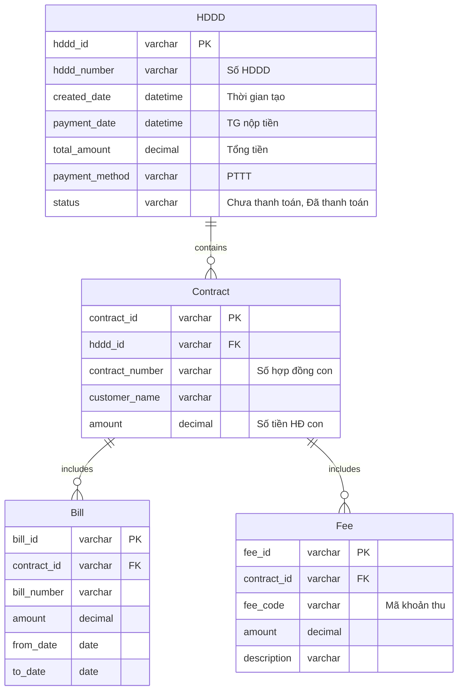
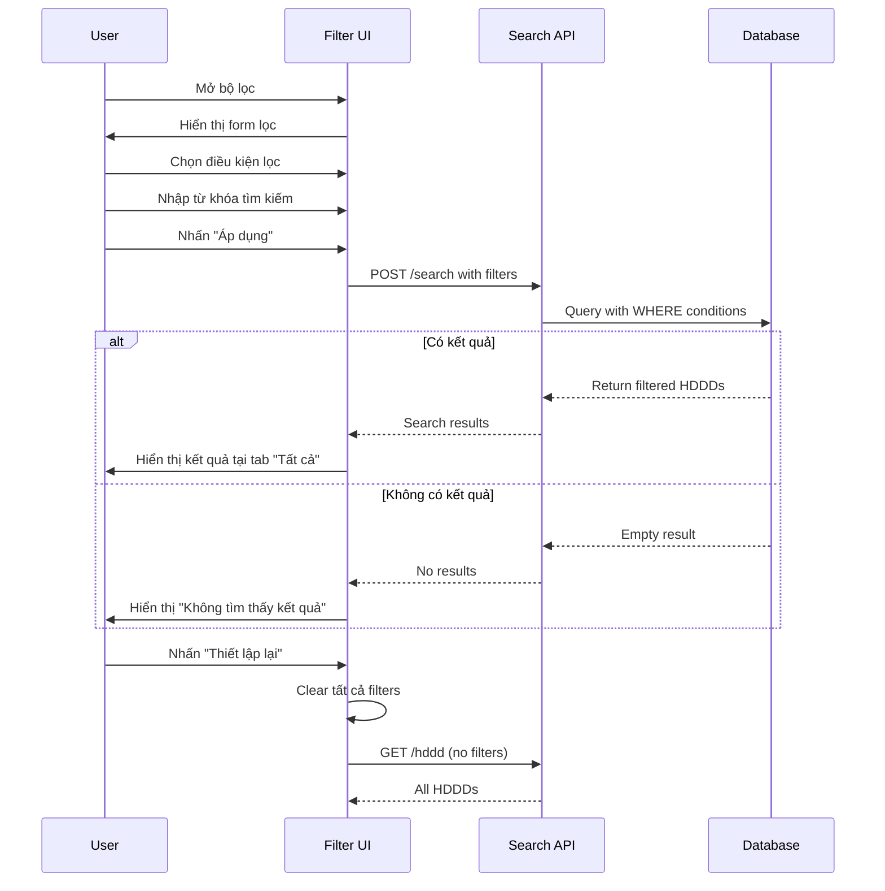
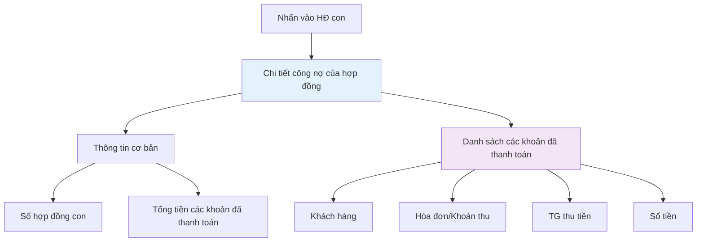
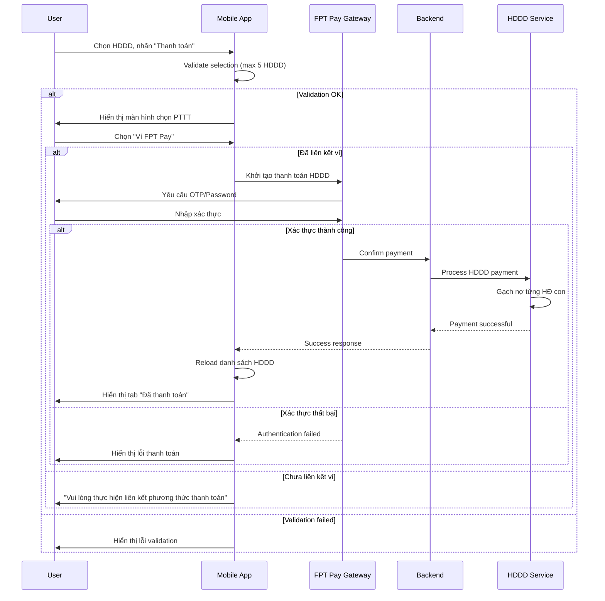
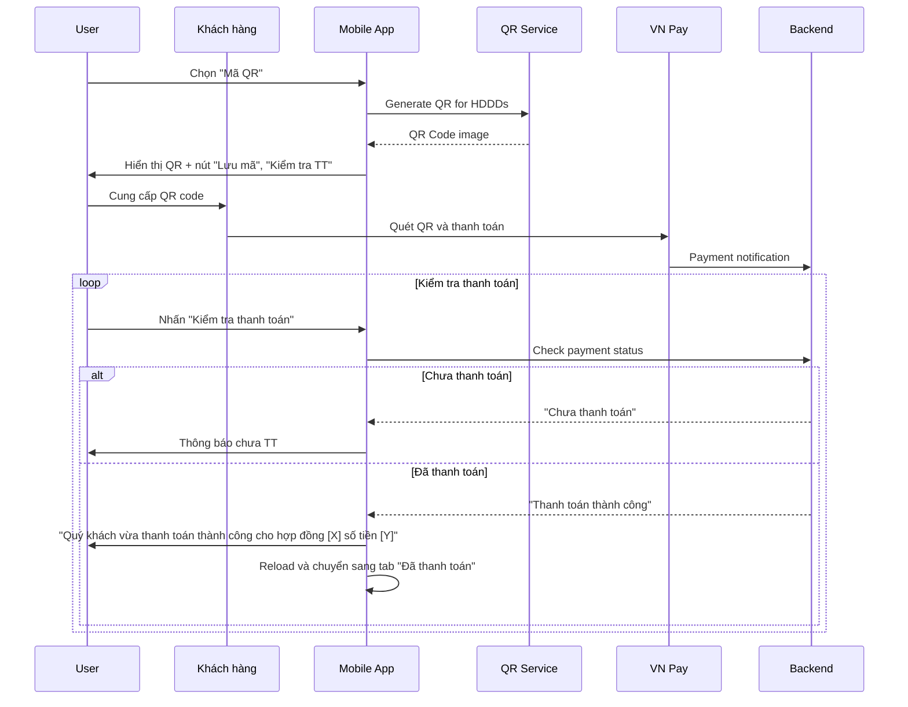
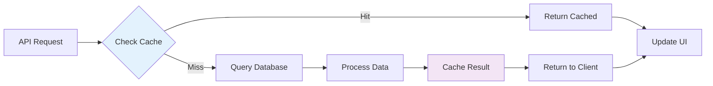

# Module Thanh toán hợp đồng đại diện - Representative Payment Analysis

**[⬅️ Quay lại Master Analysis](./MobinetNextgen_Master_Analysis.md)**

## Thông tin module | Module Information

- **Tên module:** Thanh toán hợp đồng đại diện (Representative Payment - HDDD)
- **Loại:** Upgrade  
- **Mô tả:** Cho phép người dùng xem và thanh toán hợp đồng đại diện (thanh toán nhiều hợp đồng cùng lúc)
- **Actors:** TIN/PNC, Thu cước
- **Trigger:** Nhấn "Thanh toán HDDD"
- **Priority:** High - Essential for bulk payment operations

## Sơ đồ luồng nghiệp vụ tổng quan | Overall Business Process Flow

```mermaid
flowchart TD
    Start([Nhấn "Thanh toán HDDD"]) --> LoadHDDD[Load danh sách HDDD]
    LoadHDDD --> CheckDefaultTab{Tab mặc định}
    
    CheckDefaultTab --> UnpaidTab[Tab "Chưa thanh toán"]
    
    UnpaidTab --> DisplayList[Hiển thị danh sách HDDD]
    DisplayList --> UserAction{User chọn hành động}
    
    UserAction -->|Xem chi tiết| ViewDetails[Xem chi tiết công nợ]
    UserAction -->|Tìm kiếm/Lọc| SearchFilter[Bộ lọc tìm kiếm]
    UserAction -->|Chọn thanh toán| SelectPayment[Chọn HDDD thanh toán]
    
    ViewDetails --> ShowContractDetails[Hiển thị chi tiết HĐ con]
    ShowContractDetails --> BackToList[Quay lại danh sách]
    BackToList --> DisplayList
    
    SearchFilter --> ApplyFilter[Áp dụng bộ lọc]
    ApplyFilter --> DisplayList
    
    SelectPayment --> ValidateSelection{Validation}
    ValidateSelection -->|Lỗi| ShowValidationError[Hiển thị lỗi validation]
    ValidateSelection -->|OK| ChoosePaymentMethod[Chọn phương thức thanh toán]
    
    ShowValidationError --> DisplayList
    
    ChoosePaymentMethod -->|FPT Pay| FPTPayFlow[Thanh toán FPT Pay]
    ChoosePaymentMethod -->|QR Code| QRFlow[Thanh toán QR]
    
    FPTPayFlow --> ProcessPayment[Xử lý thanh toán]
    QRFlow --> ProcessPayment
    
    ProcessPayment --> PaymentResult{Kết quả thanh toán}
    PaymentResult -->|Thành công| PaymentSuccess[Thanh toán thành công]
    PaymentResult -->|Thất bại| PaymentError[Lỗi thanh toán]
    
    PaymentSuccess --> UpdateHDDD[Gạch nợ HDDD]
    UpdateHDDD --> RefreshList[Refresh danh sách]
    RefreshList --> ShowPaidTab[Hiển thị tab "Đã thanh toán"]
    ShowPaidTab --> End([Hoàn thành])
    
    PaymentError --> ChoosePaymentMethod
    
    style Start fill:#e8f5e8
    style End fill:#e8f5e8
    style ProcessPayment fill:#bbdefb
    style PaymentSuccess fill:#c8e6c9
    style ShowValidationError fill:#ffcdd2
    style PaymentError fill:#ffcdd2
```

## Cấu trúc dữ liệu HDDD | HDDD Data Structure

### Mô hình dữ liệu


### Tính toán tổng tiền HDDD
```
Tổng tiền HDDD = Sum(Tất cả HĐ con thuộc HDDD)
Trong đó: HĐ con = Sum(Bills) + Sum(Fees) của contract đó
```

## Quản lý tabs và sắp xếp | Tab Management & Sorting

### Logic hiển thị tabs
```mermaid
flowchart TD
    LoadData[Load dữ liệu HDDD] --> CheckData{Có dữ liệu?}
    
    CheckData -->|Không| ShowEmpty[Hiển thị empty state]
    CheckData -->|Có| CategorizeTabs[Phân loại theo tabs]
    
    CategorizeTabs --> AllTab[Tab "Tất cả"]
    CategorizeTabs --> UnpaidTab[Tab "Chưa thanh toán"]
    CategorizeTabs --> PaidTab[Tab "Đã thanh toán"]
    
    AllTab --> SortAll[Chưa TT + TG tạo xa→gần, Đã TT + TG tạo gần→xa]
    UnpaidTab --> SortUnpaid[Theo TG tạo xa→gần]  
    PaidTab --> SortPaid[Theo TG thanh toán gần→xa]
    
    SortAll --> DefaultToUnpaid{Có HDDD chưa TT?}
    DefaultToUnpaid -->|Có| ShowUnpaidFirst[Hiển thị tab "Chưa thanh toán"]
    DefaultToUnpaid -->|Không| ShowAllFirst[Hiển thị tab "Tất cả"]
    
    style CategorizeTabs fill:#e3f2fd
    style DefaultToUnpaid fill:#fff3e0
```

### Thuật toán sắp xếp
```javascript
sortHDDDList(hdddList, tabType) {
    switch(tabType) {
        case 'ALL':
            return hdddList.sort((a, b) => {
                // Chưa thanh toán lên trước
                if (a.status !== b.status) {
                    return a.status === 'UNPAID' ? -1 : 1
                }
                
                // Cùng trạng thái: chưa TT theo TG xa→gần, đã TT theo TG gần→xa
                if (a.status === 'UNPAID') {
                    return new Date(b.created_date) - new Date(a.created_date) // xa→gần
                } else {
                    return new Date(a.payment_date) - new Date(b.payment_date) // gần→xa
                }
            })
            
        case 'UNPAID':
            return hdddList
                .filter(h => h.status === 'UNPAID')
                .sort((a, b) => new Date(b.created_date) - new Date(a.created_date))
                
        case 'PAID':
            return hdddList
                .filter(h => h.status === 'PAID')  
                .sort((a, b) => new Date(a.payment_date) - new Date(b.payment_date))
    }
}
```

## Business Rules chi tiết | Detailed Business Rules

### BR.6 - Quy tắc hiển thị và thao tác HDDD

#### Hiển thị danh sách HDDD
```mermaid
graph TD
    A[Danh sách HDDD] --> B{Trạng thái HDDD}
    B -->|Chưa thanh toán| C[Hiển thị checkbox + nút thanh toán]
    B -->|Đã thanh toán| D[Ẩn checkbox + mờ nút thanh toán]
    
    C --> E{Có "Chọn tất cả"?}
    E -->|Có HDDD chưa TT| F[Hiển thị "Chọn tất cả"]
    E -->|Tất cả đã TT| G[Ẩn "Chọn tất cả"]
    
    C --> H[Thông tin HDDD]
    D --> H
    
    H --> I[SHĐ - Số HDDD]
    H --> J[Thời gian tạo - Min date của HĐ con]
    H --> K[TG nộp tiền - Nếu đã thanh toán]  
    H --> L[Số tiền - Sum HĐ con]
    H --> M[PTTT - Nếu đã thanh toán]
    H --> N[Nút xem chi tiết]
    
    style B fill:#e3f2fd
    style E fill:#fff3e0
```

#### Validation thanh toán HDDD
```javascript
validateHDDDPayment(selectedHDDDs) {
    errors = []
    
    // Kiểm tra có chọn HDDD nào không
    if (selectedHDDDs.length === 0) {
        errors.push("Vui lòng chọn HDDD cần thanh toán")
        return errors
    }
    
    // Kiểm tra giới hạn tối đa 5 HDDD
    if (selectedHDDDs.length > 5) {
        errors.push("Chỉ được chọn tối đa 5 HDDD thanh toán")
        return errors
    }
    
    // Kiểm tra rule thanh toán xa nhất trước
    sortedByDate = selectedHDDDs.sort((a,b) => new Date(b.created_date) - new Date(a.created_date))
    oldestSelected = sortedByDate[0]
    
    // Lấy HDDD cũ nhất chưa được chọn
    allUnpaid = HDDDService.getAllUnpaid()
    unselectedHDDDs = allUnpaid.filter(h => !selectedHDDDs.includes(h))
    
    if (unselectedHDDDs.length > 0) {
        oldestUnselected = unselectedHDDDs.sort((a,b) => new Date(b.created_date) - new Date(a.created_date))[0]
        
        if (new Date(oldestSelected.created_date) < new Date(oldestUnselected.created_date)) {
            errors.push("Vui lòng thanh toán HDDD xa nhất")
            return errors
        }
    }
    
    return errors
}
```

### BR.6.2 - Bộ lọc tìm kiếm

#### Cấu hình bộ lọc
```yaml
search_filters:
  payment_status:
    options: ["Tất cả", "Chưa thanh toán", "Đã thanh toán"]
    default: null
    single_select: true
    
  time_range:
    options: ["Hôm nay", "7 ngày gần nhất", "Khoảng thời gian"]
    default: null
    single_select: true
    custom_range:
      max_months: 3 # Chỉ trong 3 tháng gần nhất T,T-1,T-2
      
  search_by:
    options: ["Hợp đồng đại diện", "Số hợp đồng"]
    search_fields:
      hddd_number: "Số HDDD"
      contract_number: "Số hợp đồng con"
```

#### Luồng tìm kiếm


## Chi tiết công nợ và thanh toán | Debt Details & Payment

### Màn hình chi tiết công nợ
```mermaid
flowchart TD
    ClickDetail[Nhấn "Xem chi tiết"] --> ShowHDDDInfo[Hiển thị thông tin HDDD]
    ShowHDDDInfo --> ShowContractList[Danh sách hợp đồng con]
    
    ShowContractList --> ContractInfo[Thông tin HĐ con]
    ContractInfo --> CheckboxHD[Checkbox chọn HĐ]
    ContractInfo --> ContractNumber[Số hợp đồng con]
    ContractInfo --> TotalAmount[Tổng tiền HĐ con]
    
    CheckboxHD --> PaymentButton{Nút thanh toán}
    
    PaymentButton -->|HDDD đã TT| DisablePayment[Mờ nút, không cho thao tác]
    PaymentButton -->|HDDD chưa TT| EnablePayment[Hiển thị nút thanh toán]
    
    EnablePayment --> ClickPayment[Nhấn thanh toán]
    ClickPayment --> ProcessHDDDPayment[Xử lý thanh toán HDDD]
    ProcessHDDDPayment --> RefreshDetail[Reload chi tiết]
    RefreshDetail --> ShowPaidStatus[Hiển thị ở tab "Đã thanh toán"]
    
    style ShowHDDDInfo fill:#e3f2fd
    style ProcessHDDDPayment fill:#bbdefb
    style RefreshDetail fill:#c8e6c9
```

### Chi tiết hợp đồng con


## Phương thức thanh toán HDDD | HDDD Payment Methods

### FPT Pay Payment Flow


### QR Code Payment Flow


## UI/UX Specifications | Đặc tả giao diện

### Layout màn hình chính
```
┌─────────────────────────────────────┐
│ [←] Quản lý công nợ        [🔍] [⚙️] │
├─────────────────────────────────────┤
│                                     │
│ [Tất cả]  [Chưa TT(5)]  [Đã TT(12)] │ ← Dynamic badge counts
│                                     │
│ ☐ Chọn tất cả                       │ ← Show nếu có HDDD chưa TT
│                                     │
│ ┌─────────────────────────────────┐ │
│ │ ☐ HDC2521001B008125 (2)         │ │ ← HDDD info card
│ │    TG tạo: 18/06/2024 07:45     │ │
│ │    📋 2.250.000đ    [Xem chi tiết>] │
│ └─────────────────────────────────┘ │
│                                     │
│ ┌─────────────────────────────────┐ │
│ │ ✅ HDC2521001B008126 (3) 💳      │ │ ← Đã thanh toán
│ │    TG tạo: 17/06/2024 15:30     │ │
│ │    TG nộp tiền: 18/06/2024      │ │
│ │    📋 4.500.000đ  Ví FPT Pay    │ │
│ │              [Xem chi tiết>]     │ │
│ └─────────────────────────────────┘ │
│                                     │
├─────────────────────────────────────┤
│ Tổng tiền: 2.250.000đ               │
│          [Thanh toán]               │ ← Enable khi có selection
└─────────────────────────────────────┘
```

### Màn hình bộ lọc
```
┌─────────────────────────────────────┐
│ [×] Bộ lọc                          │
├─────────────────────────────────────┤
│                                     │
│ Trạng thái                          │
│ ○ Tất cả                           │
│ ● Chưa thanh toán                   │
│ ○ Đã thanh toán                    │
│                                     │
│ Thời gian                          │
│ ○ Hôm nay                          │
│ ○ 7 ngày gần nhất                  │  
│ ● Khoảng thời gian                 │
│   [01/04/2025] - [30/06/2025]      │
│                                     │
│ Tìm kiếm theo                      │
│ ● Hợp đồng đại diện                │
│ ○ Số hợp đồng                      │
│                                     │
│ [_________________________]        │
│                                     │
├─────────────────────────────────────┤
│ [Thiết lập lại]        [Áp dụng]    │
└─────────────────────────────────────┘
```

## Performance & Optimization | Hiệu suất & Tối ưu

### Caching Strategy


### Cache TTL Settings
- **HDDD List:** 2 minutes
- **Contract Details:** 5 minutes  
- **Payment Status:** 30 seconds
- **User Permissions:** 10 minutes

### Pagination Strategy
```yaml
pagination:
  page_size: 20
  load_strategy: "on_demand"
  prefetch_next: true
  max_cache_pages: 5
```

## Testing Scenarios | Kịch bản kiểm thử

### Test Case 1: Thanh toán HDDD thành công
```
Precondition: User có HDDD chưa thanh toán, đã liên kết FPT Pay
Steps:
1. Vào màn hình "Quản lý công nợ"
2. Tab "Chưa thanh toán" hiển thị các HDDD
3. Chọn 1-5 HDDD
4. Nhấn "Thanh toán"
5. Chọn "Ví FPT Pay"
6. Nhập OTP/Password thành công
Expected: Thanh toán thành công, HDDD chuyển sang tab "Đã thanh toán"
```

### Test Case 2: Rule thanh toán xa nhất
```
Precondition: Có nhiều HDDD với thời gian tạo khác nhau
Steps:
1. Chọn HDDD gần đây, bỏ qua HDDD cũ hơn
2. Nhấn "Thanh toán"
Expected: "Vui lòng thanh toán HDDD xa nhất"
```

### Test Case 3: Vượt giới hạn 5 HDDD
```
Steps:
1. Chọn 6 HDDD hoặc hơn
2. Nhấn "Thanh toán"
Expected: "Chỉ được chọn tối đa 5 HDDD thanh toán"
```

### Test Case 4: Tìm kiếm và lọc
```
Steps:
1. Mở bộ lọc
2. Chọn "Chưa thanh toán" + "7 ngày gần nhất"
3. Nhập số HDDD vào tìm kiếm
4. Nhấn "Áp dụng"
Expected: Hiển thị kết quả phù hợp tại tab "Tất cả"
```

## Error Handling | Xử lý lỗi

### Payment Errors
```yaml
payment_errors:
  INSUFFICIENT_BALANCE: "Số dư ví FPT Pay không đủ"
  PAYMENT_TIMEOUT: "Thanh toán timeout, vui lòng thử lại"
  GATEWAY_ERROR: "Lỗi cổng thanh toán, vui lòng thử lại sau"
  INVALID_QR: "Mã QR không hợp lệ hoặc đã hết hạn"
  CONCURRENT_PAYMENT: "HDDD đang được thanh toán bởi user khác"
```

### System Errors  
```yaml
system_errors:
  HDDD_NOT_FOUND: "Không tìm thấy HDDD"
  HDDD_ALREADY_PAID: "HDDD đã được thanh toán"
  PERMISSION_DENIED: "Không có quyền thanh toán HDDD này"
  DATA_SYNC_ERROR: "Lỗi đồng bộ dữ liệu, vui lòng refresh"
```

---

**[⬅️ Quay lại Master Analysis](./MobinetNextgen_Master_Analysis.md)**

**Liên quan:**
- [Module Thanh toán](./MobinetNextgen_Payment_Analysis.md) - Logic thanh toán tương tự
- [Module Liên kết ví/Ngân hàng](./MobinetNextgen_WalletBanking_Analysis.md) - Cần liên kết để thanh toán online