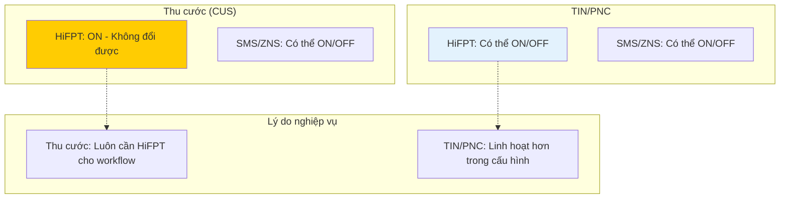
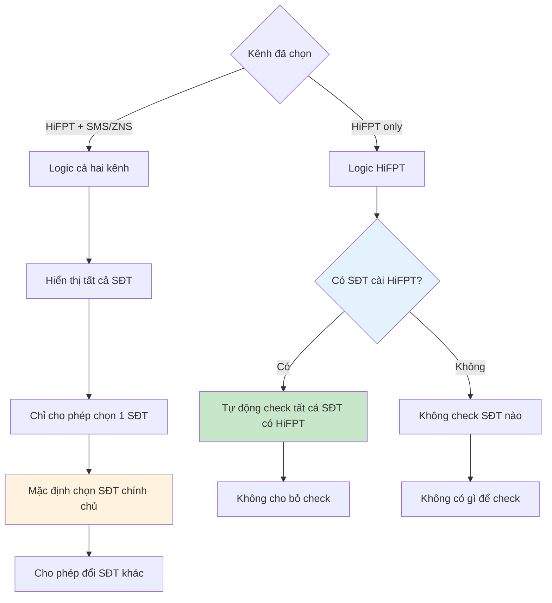
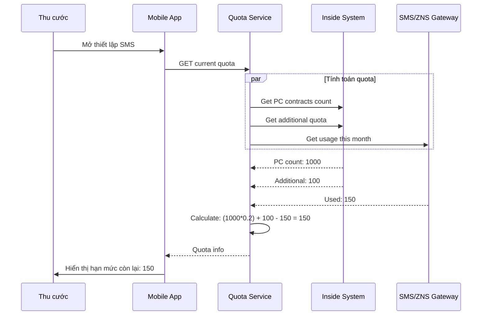
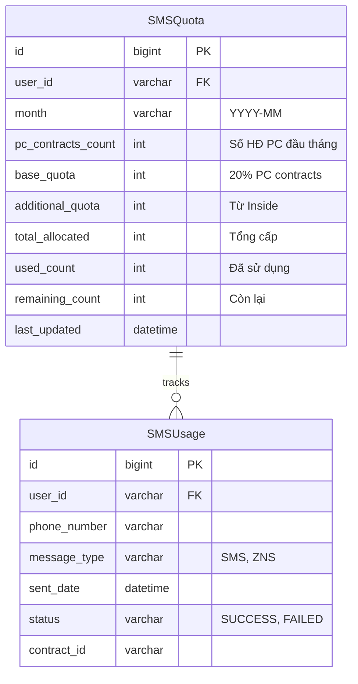
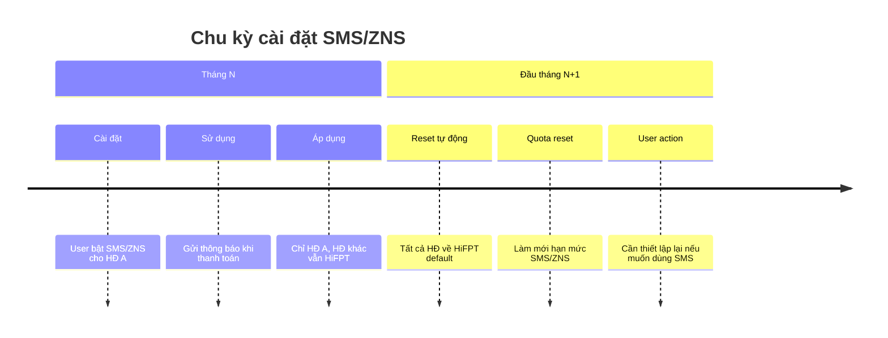

# Module Thiết lập gửi tin nhắn - SMS Setup Analysis

**[⬅️ Quay lại Master Analysis](./MobinetNextgen_Master_Analysis.md)**

## Thông tin module | Module Information

- **Tên module:** Thiết lập gửi tin nhắn (SMS Setup)
- **Loại:** Upgrade
- **Mô tả:** Cho phép người dùng thiết lập tin nhắn gửi qua kênh nào khi thanh toán và xem hạn mức gửi tin SMS/ZNS
- **Actors:** TIN/PNC, Thu cước (CUS)
- **Trigger:** Nhấn "Thiết lập gửi tin nhắn"
- **Priority:** Medium - Configuration for notification channels

## Sơ đồ luồng nghiệp vụ | Business Process Flow

```mermaid
flowchart TD
    Start([Nhấn "Thiết lập gửi tin nhắn"]) --> CheckRole{Kiểm tra role}
    
    CheckRole -->|Thu cước| CUSFlow[Luồng Thu cước]
    CheckRole -->|TIN/PNC| TINFlow[Luồng TIN/PNC]
    CheckRole -->|Khác| NoAccess[Không có quyền]
    
    CUSFlow --> ForceHiFPT[Bắt buộc HiFPT = ON]
    TINFlow --> ConfigHiFPT[Có thể cấu hình HiFPT]
    
    ForceHiFPT --> ConfigSMS[Cấu hình SMS/ZNS]
    ConfigHiFPT --> ConfigSMS
    
    ConfigSMS --> CheckSMSToggle{Bật SMS/ZNS?}
    CheckSMSToggle -->|Bật| ShowQuota[Hiển thị hạn mức SMS]
    CheckSMSToggle -->|Tắt| HideQuota[Ẩn hạn mức SMS]
    
    ShowQuota --> LoadPhoneList[Load danh sách SĐT]
    HideQuota --> LoadPhoneList
    
    LoadPhoneList --> CheckChannels{Kênh gửi nào?}
    CheckChannels -->|HiFPT only| HiFPTOnlyFlow[Chỉ gửi HiFPT]
    CheckChannels -->|Both channels| BothChannelsFlow[Cả HiFPT và SMS/ZNS]
    
    HiFPTOnlyFlow --> SelectHiFPTPhones[Chọn SĐT có HiFPT]
    BothChannelsFlow --> SelectSinglePhone[Chỉ chọn 1 SĐT]
    
    SelectHiFPTPhones --> AutoSelect[Tự động check SĐT có HiFPT]
    SelectSinglePhone --> DefaultMainPhone[Mặc định SĐT chính chủ]
    
    AutoSelect --> ApplySettings[Áp dụng cài đặt]
    DefaultMainPhone --> ApplyButton{Nhấn "Áp dụng"?}
    
    ApplyButton -->|Có| ApplySettings
    ApplyButton -->|Không| LoadPhoneList
    
    ApplySettings --> SaveToDB[Lưu cài đặt]
    SaveToDB --> UpdateUI[Cập nhật giao diện]
    UpdateUI --> End([Hoàn thành])
    
    NoAccess --> End
    
    style Start fill:#e8f5e8
    style End fill:#e8f5e8
    style ForceHiFPT fill:#ffcc02
    style ApplySettings fill:#c8e6c9
    style NoAccess fill:#ffcdd2
```

## Cấu hình kênh thông báo | Notification Channel Configuration

### Ma trận cấu hình theo role


### Logic chọn số điện thoại


## Quản lý hạn mức SMS/ZNS | SMS/ZNS Quota Management

### Công thức tính hạn mức
```
Số lượng tin cấp = 20% * Số hợp đồng PC đầu tháng + Hạn mức cấp thêm trên Inside
Số lượng sử dụng = Tổng tin nhắn Zalo/SMS đã gửi thành công trong tháng
Số lượng còn lại = Số lượng tin cấp - Số lượng sử dụng
```

### Sơ đồ quản lý quota


### Cấu trúc dữ liệu quota


## Business Rules chi tiết | Detailed Business Rules

### BR.5 - Quy tắc thiết lập kênh

#### Cấu hình mặc định theo role
```javascript
getDefaultChannelConfig(userRole) {
    if (userRole === 'CUS') { // Thu cước
        return {
            hifpt: {
                enabled: true,
                editable: false,
                reason: "Bắt buộc cho Thu cước"
            },
            sms_zns: {
                enabled: false, // Mặc định tắt
                editable: true,
                fallback: true // Gửi SMS nếu ZNS thất bại
            }
        }
    } else if (userRole === 'TIN' || userRole === 'PNC') {
        return {
            hifpt: {
                enabled: true,
                editable: true
            },
            sms_zns: {
                enabled: false,
                editable: true
            }
        }
    }
}
```

#### Validation rules cho SMS/ZNS
```javascript
validateSMSSettings(userId, phoneSettings) {
    // Kiểm tra hạn mức tháng
    monthlyQuota = QuotaService.getMonthlyQuota(userId)
    if (monthlyQuota.remaining <= 0) {
        return {
            valid: false,
            error: "Tài khoản đã hết số lần được gửi thông báo"
        }
    }
    
    // Kiểm tra giới hạn 10 lần/SĐT/tháng
    for (phone of phoneSettings.selectedPhones) {
        phoneUsage = SMSService.getPhoneUsage(phone, getCurrentMonth())
        if (phoneUsage >= 10) {
            return {
                valid: false,
                error: `Số điện thoại ${phone} đã gửi quá 10 lần trong tháng`
            }
        }
    }
    
    // Chỉ cho phép chọn 1 SĐT khi bật cả 2 kênh
    if (phoneSettings.hifpt && phoneSettings.sms_zns) {
        if (phoneSettings.selectedPhones.length > 1) {
            return {
                valid: false,
                error: "Chỉ được chọn 1 số điện thoại khi bật cả HiFPT và SMS/ZNS"
            }
        }
    }
    
    return { valid: true }
}
```

### BR.5.2 - Quy tắc reset cài đặt

#### Chu kỳ reset hàng tháng


#### Reset logic
```javascript
resetMonthlySettings() {
    // Chạy vào 00:00 ngày 1 hàng tháng
    allUsers = UserService.getAllCUSUsers()
    
    for (user of allUsers) {
        // Reset tất cả contract về HiFPT only
        ContractService.resetToHiFPTOnly(user.id)
        
        // Reset SMS quota
        QuotaService.resetMonthlyQuota(user.id)
        
        // Log reset action
        AuditService.log({
            userId: user.id,
            action: 'MONTHLY_SMS_RESET',
            timestamp: new Date()
        })
    }
}
```

## Template tin nhắn | Message Templates

### Template HiFPT (Rich Message)
```yaml
hifpt_template:
  type: "rich_card"
  title: "XÁC NHẬN THANH TOÁN"
  subtitle: "Cảm ơn Quý khách đã thanh toán thành công"
  content:
    contract_info:
      - "Địa chỉ lắp đặt: ${customer_address}"
      - "Số chứng từ: ${document_number}"
      - "Kỳ cước: ${billing_period}"
    payment_info:
      - "Tổng tiền: ${total_amount}"
      - "Số tiền đã thanh toán: ${paid_amount}"
      - "Thanh toán bằng: ${payment_method}"
      - "Ngày thanh toán: ${payment_date}"
    fgold_info:
      - "Tích lũy FGold: ${fgold_points}"
      - "Tổng điểm FGold: ${total_fgold}"
  actions:
    - type: "button"
      text: "Đăng ký trả trước"
      deeplink: "hifpt://prepaid/register"
```

### Template SMS Thu cước
```
Cam on ban da thanh toan thanh cong so ${amount}d, so chung tu: ${document_id} tu ngay ${from_date} – ${to_date} cua hop dong ${contract_id}. LH 19006600
```

### Template ZNS Zalo
```yaml
zns_template:
  template_id: "payment_confirmation_v2"
  params:
    customer_name: "${customer_name}"
    amount: "${amount}"
    document_id: "${document_id}"
    billing_period: "${billing_period}"
    contract_id: "${contract_id}"
    payment_date: "${payment_date}"
    fgold_points: "${fgold_points}"
  buttons:
    - text: "Xem chi tiết"
      type: "url"
      url: "https://fpt.vn/pay/${transaction_id}"
```

### Template SMS Kỹ thuật
```
FPT Telecom thong bao: So tien Quy khach thanh toan cho HD ${contract_id} la ${amount} VND. Xin cam on. (ISC01.TRANGPT30)
```

## API Specifications | Đặc tả API

### GET /api/sms-settings/{userId}
```yaml
summary: Lấy cài đặt SMS hiện tại
responses:
  200:
    schema:
      type: object
      properties:
        user_id: string
        channels:
          type: object
          properties:
            hifpt:
              type: object
              properties:
                enabled: boolean
                editable: boolean
            sms_zns:
              type: object
              properties:
                enabled: boolean
                editable: boolean
        phone_numbers:
          type: array
          items:
            type: object
            properties:
              number: string
              is_main: boolean
              has_hifpt: boolean
              selected: boolean
        quota:
          type: object
          properties:
            total_allocated: integer
            used_count: integer
            remaining_count: integer
```

### PUT /api/sms-settings/{userId}
```yaml
summary: Cập nhật cài đặt SMS
requestBody:
  content:
    application/json:
      schema:
        type: object
        properties:
          channels:
            type: object
            properties:
              hifpt: boolean
              sms_zns: boolean
          selected_phones:
            type: array
            items:
              type: string
responses:
  200:
    description: Cập nhật thành công
  400:
    description: Validation error
  409:
    description: Vượt quá hạn mức
```

## UI/UX Specifications | Đặc tả giao diện

### Layout chính
```
┌─────────────────────────────────────┐
│ [←] Thiết lập gửi xác nhận TT       │
├─────────────────────────────────────┤
│                                     │
│ Thiết lập gửi tin nhắn             │
│                                     │
│ Gửi qua Hi FPT        [🟢 ON]      │ ← Không đổi được (CUS)
│                                     │
│ Gửi qua Zalo/SMS      [⚪ OFF]     │
│                                     │
│ ────────────────────────────────    │
│                                     │
│ 📊 Hạn mức gửi Zalo/SMS            │ ← Hiện khi bật SMS/ZNS
│                                     │
│ Số lượng tin cấp      250           │
│ Số lượng sử dụng      87            │
│ Số lượng còn lại      163           │
│                                     │
│ ────────────────────────────────    │
│                                     │
│ 📱 Số điện thoại                   │
│                                     │
│ ☑️ 0798377205 (Chính chủ) 📱       │ ← Icon HiFPT
│ ☐ 0971878906 (Nhận tin) 📱          │
│ ☐ 0965213301 (Nhận tin)            │
│ ☐ 0796389654 (Nhận tin)            │
│                                     │
│ Mặc định ban đầu                    │
│                                     │
│ ────────────────────────────────    │
│                                     │
│            [Áp dụng]                │
│                                     │
└─────────────────────────────────────┘
```

### Trạng thái toggle
```css
/* HiFPT Toggle - Disabled for CUS */
.hifpt-toggle.disabled {
    opacity: 0.6;
    pointer-events: none;
}

/* SMS Toggle - Interactive */
.sms-toggle.enabled {
    background: #4CAF50;
}

.sms-toggle.disabled {
    background: #CCCCCC;
}
```

### Icon indicators
- 📱 HiFPT installed
- ☑️ Selected phone
- ☐ Unselected phone
- 🟢 Channel enabled
- ⚪ Channel disabled

## Testing Scenarios | Kịch bản kiểm thử

### Test Case 1: Thu cước thiết lập SMS/ZNS
```
Precondition: User role = CUS, đã đăng nhập
Steps:
1. Vào "Thiết lập gửi tin nhắn"
2. Verify HiFPT toggle = ON và không đổi được
3. Bật toggle "Gửi qua Zalo/SMS"
4. Kiểm tra hiển thị hạn mức
5. Chọn 1 SĐT từ danh sách
6. Nhấn "Áp dụng"
Expected: Lưu cài đặt thành công, SMS/ZNS enabled cho contract hiện tại
```

### Test Case 2: Vượt hạn mức SMS
```
Precondition: User đã hết quota SMS trong tháng
Steps:
1. Cố gắng bật "Gửi qua Zalo/SMS"
Expected: Hiển thị "Tài khoản đã hết số lần được gửi thông báo"
```

### Test Case 3: SĐT vượt giới hạn 10 lần/tháng
```
Precondition: 1 SĐT đã gửi 10 lần SMS trong tháng
Steps:
1. Chọn SĐT đó trong danh sách
2. Nhấn "Áp dụng"
Expected: "Số điện thoại xxx đã gửi quá 10 lần trong tháng. Vui lòng liên hệ DVKH..."
```

### Test Case 4: Reset hàng tháng
```
Precondition: Tháng trước đã cài đặt SMS cho một số contract
Steps:
1. Vào đầu tháng mới
2. Kiểm tra cài đặt SMS
Expected: Tất cả contracts reset về HiFPT only, cần thiết lập lại
```

---

**[⬅️ Quay lại Master Analysis](./MobinetNextgen_Master_Analysis.md)**

**Liên quan:**
- [Module Thanh toán](./MobinetNextgen_Payment_Analysis.md) - Sử dụng cài đặt SMS để gửi thông báo
- [Module Trả lý do không thanh toán](./MobinetNextgen_NonPaymentReason_Analysis.md) - Cũng cần thông báo khách hàng