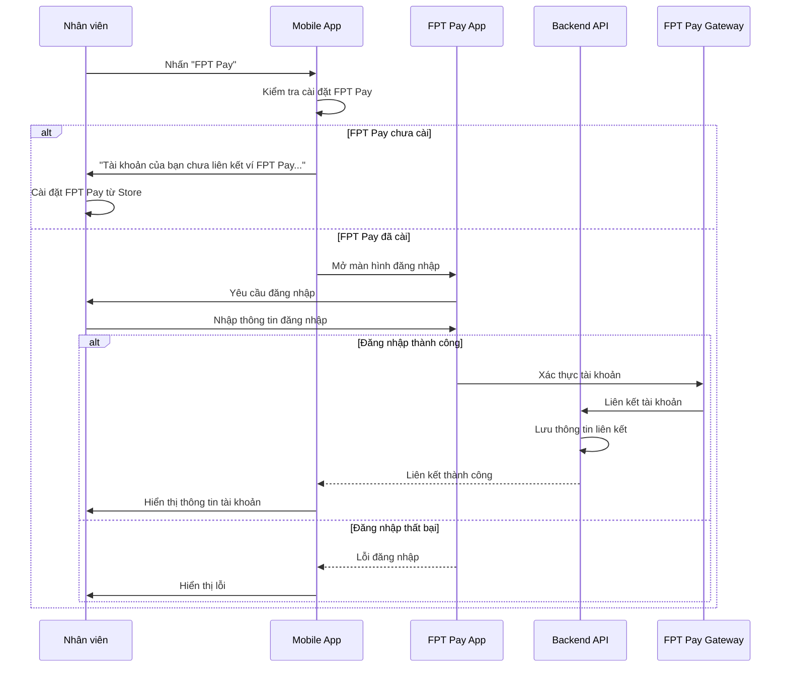
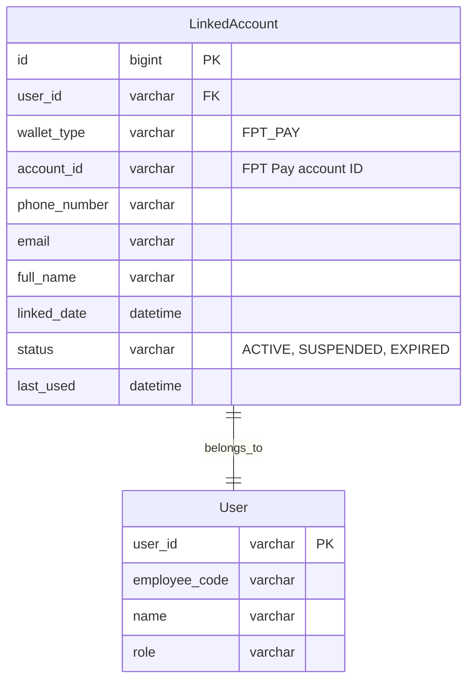
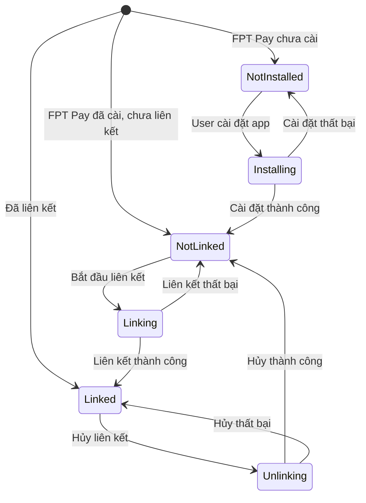
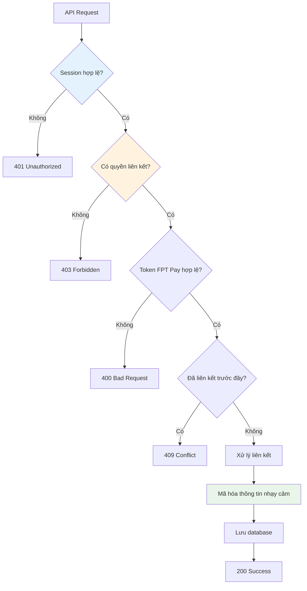

# Module Liên kết ví/Ngân hàng - Wallet Banking Analysis

**[⬅️ Quay lại Master Analysis](./MobinetNextgen_Master_Analysis.md)**

## Thông tin module | Module Information

- **Tên module:** Liên kết ví/Ngân hàng (Wallet Banking)
- **Loại:** Upgrade
- **Mô tả:** Cho phép người dùng liên kết hoặc hủy liên kết ví hoặc ngân hàng
- **Actors:** TIN/PNC, Thu cước
- **Trigger:** Nhấn chức năng "Phương thức thanh toán"
- **Priority:** High - Required for online payment methods

## Sơ đồ luồng nghiệp vụ | Business Process Flow

```mermaid
flowchart TD
    Start([Nhấn "Phương thức thanh toán"]) --> CheckLinking{Kiểm tra trạng thái liên kết}
    
    CheckLinking -->|Chưa liên kết| NotLinked[Chưa liên kết FPT Pay]
    CheckLinking -->|Đã liên kết| Linked[Đã liên kết FPT Pay]
    
    NotLinked --> CheckAppInstall{Đã cài FPT Pay?}
    CheckAppInstall -->|Chưa cài| ShowInstallMessage[Hiển thị thông báo cài đặt]
    CheckAppInstall -->|Đã cài| ShowLoginScreen[Hiển thị màn hình đăng nhập FPT Pay]
    
    ShowInstallMessage --> InstallApp[User cài đặt FPT Pay]
    InstallApp --> ShowLoginScreen
    
    ShowLoginScreen --> LoginFPTPay[Đăng nhập FPT Pay]
    LoginFPTPay --> LinkSuccess{Liên kết thành công?}
    
    LinkSuccess -->|Thành công| UpdateLinkStatus[Cập nhật trạng thái liên kết]
    LinkSuccess -->|Thất bại| LinkError[Hiển thị lỗi liên kết]
    
    UpdateLinkStatus --> ShowLinkedInfo[Hiển thị thông tin đã liên kết]
    LinkError --> NotLinked
    
    Linked --> ShowAccountInfo[Hiển thị thông tin tài khoản]
    ShowAccountInfo --> UserChoice{User chọn hành động}
    
    UserChoice -->|Xem thông tin| ShowDetails[Hiển thị chi tiết tài khoản]
    UserChoice -->|Hủy liên kết| ConfirmUnlink[Xác nhận hủy liên kết]
    
    ShowDetails --> End([Hoàn thành])
    
    ConfirmUnlink --> UnlinkChoice{Chọn hủy?}
    UnlinkChoice -->|Đồng ý| ProcessUnlink[Thực hiện hủy liên kết]
    UnlinkChoice -->|Hủy| ShowAccountInfo
    
    ProcessUnlink --> UnlinkSuccess[Hủy liên kết thành công]
    UnlinkSuccess --> NotLinked
    
    ShowLinkedInfo --> End
    
    style Start fill:#e8f5e8
    style End fill:#e8f5e8
    style LinkSuccess fill:#bbdefb
    style UnlinkSuccess fill:#c8e6c9
    style LinkError fill:#ffcdd2
```

## Chi tiết tích hợp FPT Pay | FPT Pay Integration Details

### Quy trình liên kết ví FPT Pay


### Cấu trúc dữ liệu tài khoản liên kết


## Business Rules chi tiết | Detailed Business Rules

### BR.4 - Quy tắc liên kết và hủy liên kết

#### Điều kiện liên kết FPT Pay
```javascript
validateLinkingEligibility(userId) {
    user = UserService.getUser(userId)
    
    // Check user role permissions
    if (!user.roles.includes('TIN') && 
        !user.roles.includes('PNC') && 
        !user.roles.includes('CUS')) {
        return {
            eligible: false,
            reason: "Không có quyền liên kết ví"
        }
    }
    
    // Check if already linked
    existingLink = LinkedAccountService.getActiveLink(userId, 'FPT_PAY')
    if (existingLink) {
        return {
            eligible: false,
            reason: "Tài khoản đã liên kết với ví FPT Pay"
        }
    }
    
    // Check FPT Pay app installation
    if (!DeviceService.isAppInstalled('com.fpt.pay')) {
        return {
            eligible: false,
            reason: "Chưa cài đặt ứng dụng FPT Pay",
            action: "INSTALL_APP"
        }
    }
    
    return { eligible: true }
}
```

#### Quy trình hủy liên kết
```mermaid
flowchart TD
    UnlinkRequest[Nhấn "Hủy liên kết"] --> CheckActiveTransactions{Có giao dịch đang xử lý?}
    
    CheckActiveTransactions -->|Có| BlockUnlink[Không cho phép hủy]
    CheckActiveTransactions -->|Không| ShowConfirmation[Hiển thị xác nhận]
    
    BlockUnlink --> ShowBlockMessage["Không thể hủy liên kết khi có giao dịch đang xử lý"]
    
    ShowConfirmation --> UserConfirm{User xác nhận?}
    UserConfirm -->|Không| CancelUnlink[Hủy thao tác]
    UserConfirm -->|Có| ProcessUnlink[Thực hiện hủy liên kết]
    
    ProcessUnlink --> CallAPI[Gọi API hủy liên kết]
    CallAPI --> UpdateStatus[Cập nhật trạng thái INACTIVE]
    UpdateStatus --> NotifyUser[Thông báo thành công]
    NotifyUser --> RefreshUI[Refresh giao diện]
    
    style CheckActiveTransactions fill:#fff3e0
    style BlockUnlink fill:#ffcdd2
    style NotifyUser fill:#c8e6c9
```

## Giao diện người dùng | User Interface

### Màn hình chưa liên kết
```
┌─────────────────────────────────────┐
│ [←] Phương thức thanh toán          │
├─────────────────────────────────────┤
│                                     │
│ 💳 Ví FPT Pay                       │
│                                     │
│ [🏦] FPT Pay    [Chưa liên kết >]   │
│                                     │
│ ────────────────────────────────    │
│                                     │
│ ℹ️ Liên kết ví FPT Pay để thanh     │
│   toán nhanh chóng và thuận tiện    │
│                                     │
│ • Bảo mật cao                       │
│ • Thanh toán nhanh                  │
│ • Không phí giao dịch               │
│                                     │
└─────────────────────────────────────┘
```

### Màn hình đã liên kết
```
┌─────────────────────────────────────┐
│ [←] Tài khoản thanh toán            │
├─────────────────────────────────────┤
│                                     │
│ 👤 Thông tin tài khoản              │
│                                     │
│ Họ và tên nhân sự                   │
│ Nguyễn Văn An                       │
│                                     │
│ Email                               │
│ nvan@fpt.com                        │
│                                     │
│ Mã nhân viên                        │
│ 00196993                            │
│                                     │
│ Số điện thoại                       │
│ 0965874475                          │
│                                     │
│ ────────────────────────────────    │
│                                     │
│          [Hủy liên kết 🗑️]          │
│                                     │
└─────────────────────────────────────┘
```

### Trạng thái và thông báo


## API Specifications | Đặc tả API

### POST /api/wallet/link
```yaml
summary: Liên kết ví FPT Pay
requestBody:
  required: true
  content:
    application/json:
      schema:
        type: object
        properties:
          wallet_type:
            type: string
            enum: ['FPT_PAY']
          auth_token:
            type: string
            description: Token từ FPT Pay
          device_info:
            type: object
            properties:
              device_id: string
              os_version: string
              app_version: string
responses:
  200:
    description: Liên kết thành công
    schema:
      type: object
      properties:
        success: boolean
        data:
          type: object
          properties:
            account_id: string
            phone_number: string
            email: string
            full_name: string
            linked_date: string
  400:
    description: Dữ liệu không hợp lệ
  409:
    description: Tài khoản đã liên kết
```

### DELETE /api/wallet/unlink
```yaml
summary: Hủy liên kết ví
parameters:
  - name: wallet_type
    in: query
    required: true
    schema:
      type: string
      enum: ['FPT_PAY']
responses:
  200:
    description: Hủy liên kết thành công
  400:
    description: Không thể hủy liên kết (có giao dịch đang xử lý)
  404:
    description: Không tìm thấy liên kết
```

### GET /api/wallet/status
```yaml
summary: Kiểm tra trạng thái liên kết
responses:
  200:
    schema:
      type: object
      properties:
        linked: boolean
        wallet_info:
          type: object
          properties:
            account_id: string
            masked_phone: string
            full_name: string
            linked_date: string
            last_used: string
```

## Tích hợp bảo mật | Security Integration

### Xác thực và phân quyền


### Bảo mật thông tin nhạy cảm
- **Mã hóa:** Thông tin tài khoản được mã hóa AES-256
- **Masking:** Số điện thoại hiển thị dạng 096***4475
- **Token expiry:** Token liên kết có thời hạn 24h
- **Audit log:** Ghi nhận tất cả thao tác liên kết/hủy liên kết

## Testing Scenarios | Kịch bản kiểm thử

### Test Case 1: Liên kết thành công
```
Precondition: User chưa liên kết, đã cài FPT Pay
Steps:
1. Vào màn hình "Phương thức thanh toán"
2. Nhấn "FPT Pay"
3. Đăng nhập FPT Pay thành công
4. Xác nhận liên kết
Expected: Hiển thị thông tin tài khoản đã liên kết
```

### Test Case 2: FPT Pay chưa cài
```
Precondition: FPT Pay chưa được cài trên thiết bị
Steps:
1. Nhấn "FPT Pay"
Expected: Hiển thị thông báo "Tài khoản của bạn chưa liên kết ví FPT Pay. Vui lòng tải và cài đặt FPT Pay..."
```

### Test Case 3: Hủy liên kết
```
Precondition: Tài khoản đã liên kết, không có giao dịch pending
Steps:
1. Vào màn hình thông tin tài khoản
2. Nhấn "Hủy liên kết"
3. Xác nhận "Đồng ý"
Expected: Hủy liên kết thành công, quay về trạng thái chưa liên kết
```

### Test Case 4: Không thể hủy liên kết
```
Precondition: Có giao dịch đang xử lý
Steps:
1. Nhấn "Hủy liên kết"
Expected: Hiển thị thông báo không thể hủy do có giao dịch pending
```

## Error Handling | Xử lý lỗi

### Lỗi liên kết
```yaml
link_errors:
  INVALID_CREDENTIALS: "Thông tin đăng nhập FPT Pay không chính xác"
  ACCOUNT_LOCKED: "Tài khoản FPT Pay đã bị khóa"
  NETWORK_ERROR: "Lỗi kết nối. Vui lòng thử lại"
  SERVER_ERROR: "Lỗi hệ thống. Vui lòng thử lại sau"
  ALREADY_LINKED: "Tài khoản này đã được liên kết với ví FPT Pay khác"
  APP_NOT_INSTALLED: "Vui lòng cài đặt ứng dụng FPT Pay"
```

### Lỗi hủy liên kết
```yaml
unlink_errors:
  PENDING_TRANSACTIONS: "Không thể hủy liên kết khi có giao dịch đang xử lý"
  NOT_LINKED: "Tài khoản chưa được liên kết"
  INSUFFICIENT_PERMISSION: "Không có quyền thực hiện thao tác này"
```

## Performance & Caching | Hiệu suất & Cache

### Caching strategy
- **Link status:** Cache 5 phút
- **Account info:** Cache 10 phút  
- **App installation check:** Cache 1 phút
- **Permissions:** Cache 30 phút

### Performance metrics
- **Link process:** < 10 seconds end-to-end
- **Status check:** < 500ms
- **Unlink process:** < 3 seconds

---

**[⬅️ Quay lại Master Analysis](./MobinetNextgen_Master_Analysis.md)**

**Liên quan:**
- [Module Thanh toán](./MobinetNextgen_Payment_Analysis.md) - Sử dụng ví đã liên kết để thanh toán
- [Module Xem hạn mức thanh toán](./MobinetNextgen_PaymentLimit_Analysis.md) - Alternative khi hết hạn mức