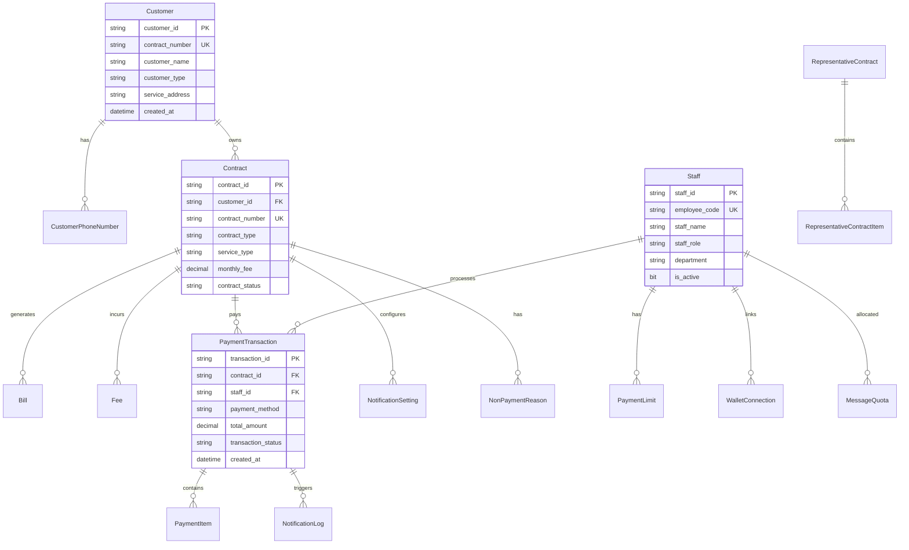
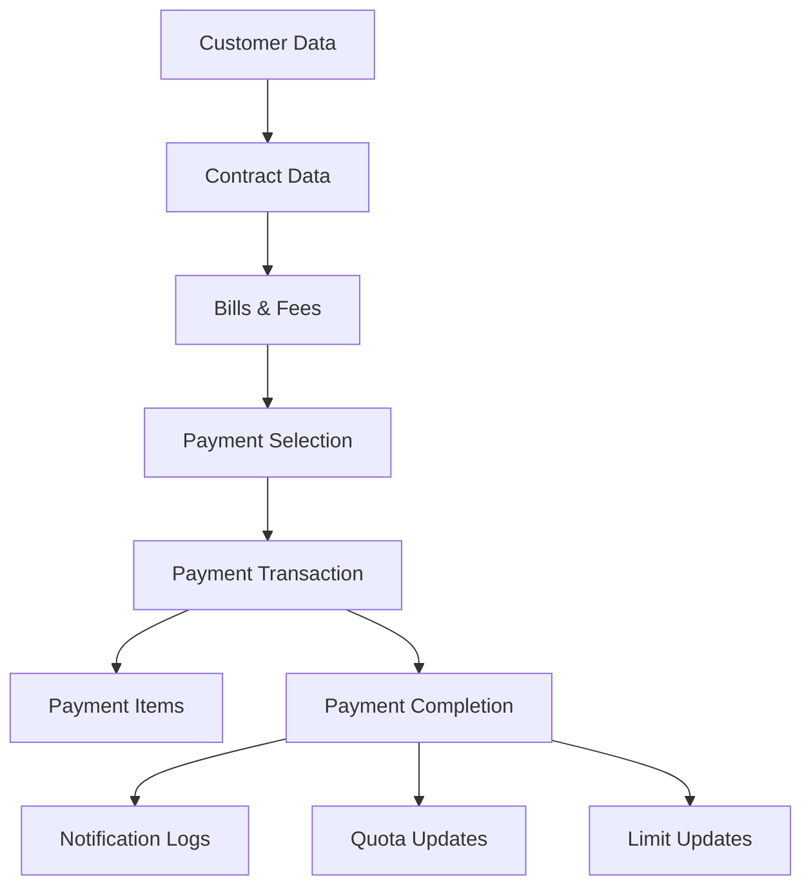
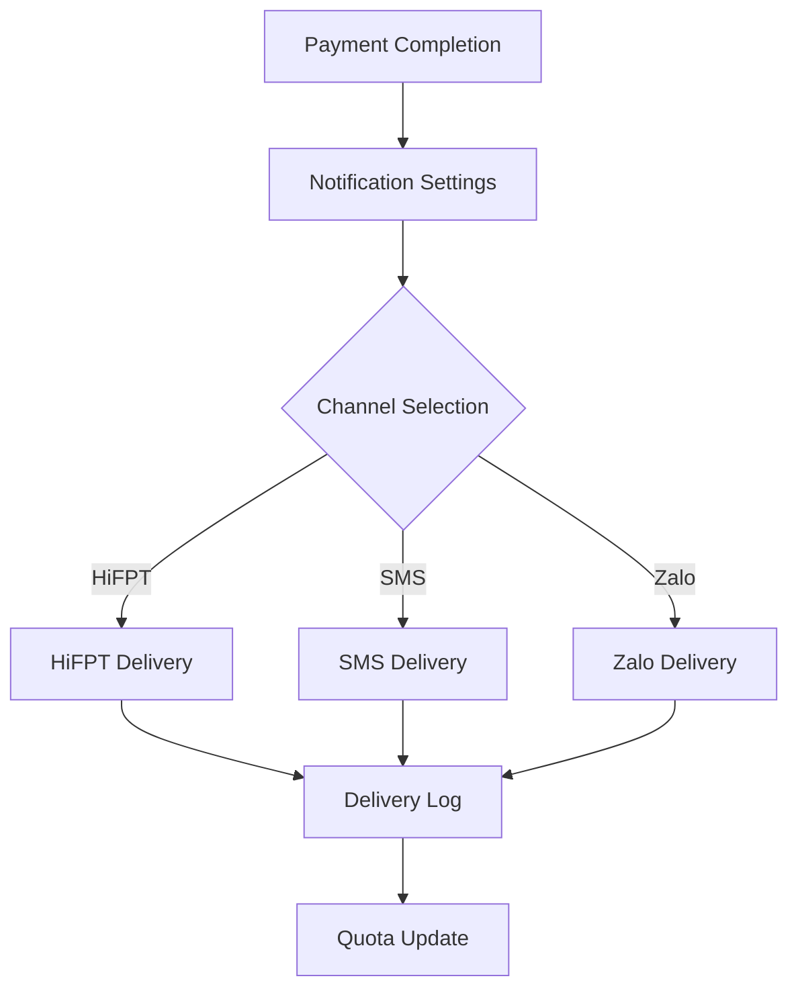

# Mobinet NextGen - Database Design Analysis

## Database Overview

**Purpose:** Comprehensive data model design for Mobinet NextGen payment system  
**Scope:** All entities, relationships, and data flow requirements  
**Target:** Architecture and Database Design documentation support

## Core Data Entities

### Customer & Contract Management

#### Customer Entity
```sql
-- Customer master data
Customer {
  customer_id: VARCHAR(20) PRIMARY KEY,
  contract_number: VARCHAR(20) UNIQUE NOT NULL,
  customer_name: NVARCHAR(255) NOT NULL,
  customer_type: VARCHAR(20) NOT NULL, -- individual, business
  service_address: NVARCHAR(500),
  registration_date: DATETIME,
  status: VARCHAR(20) DEFAULT 'active',
  created_at: DATETIME DEFAULT CURRENT_TIMESTAMP,
  updated_at: DATETIME DEFAULT CURRENT_TIMESTAMP
}
```

#### Customer Phone Numbers
```sql
CustomerPhoneNumber {
  id: BIGINT PRIMARY KEY IDENTITY,
  customer_id: VARCHAR(20) REFERENCES Customer(customer_id),
  phone_number: VARCHAR(15) NOT NULL,
  phone_type: VARCHAR(20) NOT NULL, -- primary, messaging, other
  has_hifpt_app: BIT DEFAULT 0,
  is_active: BIT DEFAULT 1,
  priority_order: INT DEFAULT 0,
  created_at: DATETIME DEFAULT CURRENT_TIMESTAMP,
  
  UNIQUE INDEX idx_customer_phone (customer_id, phone_number)
}
```

#### Contract Information
```sql
Contract {
  contract_id: VARCHAR(20) PRIMARY KEY,
  customer_id: VARCHAR(20) REFERENCES Customer(customer_id),
  contract_number: VARCHAR(20) UNIQUE NOT NULL,
  contract_type: VARCHAR(50) NOT NULL, -- normal, abnormal, etc.
  service_type: VARCHAR(50) NOT NULL, -- internet, cable, phone
  monthly_fee: DECIMAL(15,2),
  contract_status: VARCHAR(20) DEFAULT 'active',
  start_date: DATE,
  end_date: DATE,
  has_hddt: BIT DEFAULT 0, -- Contract signature status
  has_plhd: BIT DEFAULT 0,
  has_bbdt: BIT DEFAULT 0,
  created_at: DATETIME DEFAULT CURRENT_TIMESTAMP
}
```

### Bill & Fee Management

#### Bills
```sql
Bill {
  bill_id: VARCHAR(30) PRIMARY KEY,
  contract_id: VARCHAR(20) REFERENCES Contract(contract_id),
  bill_number: VARCHAR(30) UNIQUE NOT NULL,
  billing_period_from: DATE NOT NULL,
  billing_period_to: DATE NOT NULL,
  issue_date: DATE NOT NULL,
  due_date: DATE,
  amount: DECIMAL(15,2) NOT NULL,
  vat_amount: DECIMAL(15,2) DEFAULT 0,
  total_amount: DECIMAL(15,2) NOT NULL,
  bill_content: NVARCHAR(500),
  bill_status: VARCHAR(20) DEFAULT 'unpaid', -- unpaid, paid, partial
  payment_status: VARCHAR(20) DEFAULT 'pending',
  created_at: DATETIME DEFAULT CURRENT_TIMESTAMP
}
```

#### Fees
```sql
Fee {
  fee_id: VARCHAR(30) PRIMARY KEY,
  contract_id: VARCHAR(20) REFERENCES Contract(contract_id),
  fee_number: VARCHAR(30) UNIQUE NOT NULL,
  fee_type: VARCHAR(50) NOT NULL,
  fee_source: VARCHAR(50) NOT NULL, -- PTC, recare, etc.
  paid_type: INT, -- 2 for home collection fee
  amount: DECIMAL(15,2) NOT NULL,
  fee_content: NVARCHAR(500),
  from_date: DATE,
  to_date: DATE,
  fee_status: VARCHAR(20) DEFAULT 'unpaid',
  created_at: DATETIME DEFAULT CURRENT_TIMESTAMP
}
```

### Payment Processing

#### Payment Transactions
```sql
PaymentTransaction {
  transaction_id: VARCHAR(50) PRIMARY KEY,
  contract_id: VARCHAR(20) REFERENCES Contract(contract_id),
  staff_id: VARCHAR(20) REFERENCES Staff(staff_id),
  payment_method: VARCHAR(20) NOT NULL, -- cash_temp, fpt_pay, qr_code
  total_amount: DECIMAL(15,2) NOT NULL,
  transaction_status: VARCHAR(20) DEFAULT 'pending', -- pending, completed, failed
  payment_source: VARCHAR(50), -- staff_wallet, customer_direct
  external_transaction_id: VARCHAR(100),
  customer_phone_used: VARCHAR(15),
  confirmation_link: VARCHAR(500),
  created_at: DATETIME DEFAULT CURRENT_TIMESTAMP,
  completed_at: DATETIME,
  failed_at: DATETIME,
  failure_reason: NVARCHAR(500)
}
```

#### Payment Items
```sql
PaymentItem {
  item_id: BIGINT PRIMARY KEY IDENTITY,
  transaction_id: VARCHAR(50) REFERENCES PaymentTransaction(transaction_id),
  item_type: VARCHAR(10) NOT NULL, -- bill, fee
  item_reference_id: VARCHAR(30) NOT NULL, -- bill_id or fee_id
  amount: DECIMAL(15,2) NOT NULL,
  created_at: DATETIME DEFAULT CURRENT_TIMESTAMP
}
```

### Staff Management

#### Staff Information
```sql
Staff {
  staff_id: VARCHAR(20) PRIMARY KEY,
  employee_code: VARCHAR(20) UNIQUE NOT NULL,
  staff_name: NVARCHAR(255) NOT NULL,
  staff_role: VARCHAR(20) NOT NULL, -- TIN_PNC, REVENUE_COLLECTION
  department: VARCHAR(50),
  email: VARCHAR(255),
  phone_number: VARCHAR(15),
  is_active: BIT DEFAULT 1,
  created_at: DATETIME DEFAULT CURRENT_TIMESTAMP
}
```

#### Payment Limits
```sql
PaymentLimit {
  limit_id: BIGINT PRIMARY KEY IDENTITY,
  staff_id: VARCHAR(20) REFERENCES Staff(staff_id),
  limit_type: VARCHAR(20) NOT NULL, -- daily, per_transaction, monthly
  limit_amount: DECIMAL(15,2) NOT NULL,
  used_amount: DECIMAL(15,2) DEFAULT 0,
  reset_date: DATE,
  is_active: BIT DEFAULT 1,
  created_at: DATETIME DEFAULT CURRENT_TIMESTAMP,
  updated_at: DATETIME DEFAULT CURRENT_TIMESTAMP
}
```

#### Supplementary Payment Limits
```sql
SupplementaryLimit {
  id: BIGINT PRIMARY KEY IDENTITY,
  staff_id: VARCHAR(20) REFERENCES Staff(staff_id),
  granted_amount: DECIMAL(15,2) NOT NULL,
  used_amount: DECIMAL(15,2) DEFAULT 0,
  grant_date: DATE NOT NULL,
  expiry_date: DATE NOT NULL,
  qualification_check: NVARCHAR(500), -- Criteria met
  status: VARCHAR(20) DEFAULT 'active',
  created_at: DATETIME DEFAULT CURRENT_TIMESTAMP
}
```

### Notification Management

#### Notification Settings
```sql
NotificationSetting {
  setting_id: BIGINT PRIMARY KEY IDENTITY,
  contract_id: VARCHAR(20) REFERENCES Contract(contract_id),
  staff_id: VARCHAR(20) REFERENCES Staff(staff_id),
  hifpt_enabled: BIT DEFAULT 1,
  sms_zalo_enabled: BIT DEFAULT 0,
  selected_phone_number: VARCHAR(15),
  monthly_reset_date: DATE,
  created_at: DATETIME DEFAULT CURRENT_TIMESTAMP,
  updated_at: DATETIME DEFAULT CURRENT_TIMESTAMP,
  
  UNIQUE INDEX idx_contract_staff (contract_id, staff_id)
}
```

#### Notification Logs
```sql
NotificationLog {
  log_id: BIGINT PRIMARY KEY IDENTITY,
  transaction_id: VARCHAR(50) REFERENCES PaymentTransaction(transaction_id),
  channel_type: VARCHAR(20) NOT NULL, -- hifpt, sms, zalo, email
  recipient: VARCHAR(255) NOT NULL,
  message_content: NVARCHAR(2000),
  template_id: VARCHAR(50),
  delivery_status: VARCHAR(20) DEFAULT 'pending', -- pending, sent, delivered, failed
  sent_at: DATETIME,
  delivered_at: DATETIME,
  failed_at: DATETIME,
  failure_reason: NVARCHAR(500),
  external_message_id: VARCHAR(100),
  created_at: DATETIME DEFAULT CURRENT_TIMESTAMP
}
```

#### Message Quotas
```sql
MessageQuota {
  quota_id: BIGINT PRIMARY KEY IDENTITY,
  staff_id: VARCHAR(20) REFERENCES Staff(staff_id),
  quota_type: VARCHAR(20) NOT NULL, -- monthly_account, monthly_phone
  reference_id: VARCHAR(50), -- phone number for phone quotas
  total_quota: INT NOT NULL,
  used_quota: INT DEFAULT 0,
  quota_month: DATE NOT NULL, -- First day of month
  created_at: DATETIME DEFAULT CURRENT_TIMESTAMP,
  updated_at: DATETIME DEFAULT CURRENT_TIMESTAMP,
  
  UNIQUE INDEX idx_staff_quota (staff_id, quota_type, reference_id, quota_month)
}
```

### Representative Contract Management

#### Representative Contracts
```sql
RepresentativeContract {
  rep_contract_id: VARCHAR(30) PRIMARY KEY,
  parent_contract_id: VARCHAR(20) REFERENCES Contract(contract_id),
  contract_list: NVARCHAR(2000), -- JSON array of child contracts
  total_amount: DECIMAL(15,2),
  creation_date: DATE NOT NULL,
  payment_status: VARCHAR(20) DEFAULT 'unpaid',
  staff_id: VARCHAR(20) REFERENCES Staff(staff_id),
  created_at: DATETIME DEFAULT CURRENT_TIMESTAMP
}
```

#### Representative Contract Items
```sql
RepresentativeContractItem {
  item_id: BIGINT PRIMARY KEY IDENTITY,
  rep_contract_id: VARCHAR(30) REFERENCES RepresentativeContract(rep_contract_id),
  child_contract_id: VARCHAR(20) REFERENCES Contract(contract_id),
  bill_ids: NVARCHAR(1000), -- Comma-separated bill IDs
  fee_ids: NVARCHAR(1000), -- Comma-separated fee IDs
  item_amount: DECIMAL(15,2) NOT NULL,
  payment_status: VARCHAR(20) DEFAULT 'unpaid',
  created_at: DATETIME DEFAULT CURRENT_TIMESTAMP
}
```

### Reason Management

#### Non-Payment Reasons
```sql
NonPaymentReason {
  reason_id: BIGINT PRIMARY KEY IDENTITY,
  contract_id: VARCHAR(20) REFERENCES Contract(contract_id),
  staff_id: VARCHAR(20) REFERENCES Staff(staff_id),
  reason_level1: NVARCHAR(255) NOT NULL,
  reason_level2: NVARCHAR(255) NOT NULL,
  reason_level3: NVARCHAR(255),
  comments: NVARCHAR(1000),
  scheduled_payment_date: DATETIME,
  scheduled_cutoff_date: DATE,
  cutoff_status: VARCHAR(20), -- permanent, temporary
  created_at: DATETIME DEFAULT CURRENT_TIMESTAMP
}
```

### Wallet & Bank Integration

#### Wallet Connections
```sql
WalletConnection {
  connection_id: BIGINT PRIMARY KEY IDENTITY,
  staff_id: VARCHAR(20) REFERENCES Staff(staff_id),
  wallet_type: VARCHAR(20) NOT NULL, -- fpt_pay, bank_account
  wallet_identifier: VARCHAR(100) NOT NULL, -- Account number/ID
  wallet_name: NVARCHAR(255),
  is_active: BIT DEFAULT 1,
  linked_at: DATETIME DEFAULT CURRENT_TIMESTAMP,
  last_used_at: DATETIME
}
```

## Data Relationships

### Entity Relationship Diagram



## Data Flow Analysis

### Payment Data Flow



### Notification Data Flow



## Indexing Strategy

### Primary Indexes
```sql
-- Customer & Contract Performance
CREATE INDEX idx_customer_contract ON Contract(customer_id, contract_status);
CREATE INDEX idx_contract_number ON Contract(contract_number);

-- Bill & Fee Lookups
CREATE INDEX idx_contract_bills ON Bill(contract_id, bill_status, issue_date);
CREATE INDEX idx_contract_fees ON Fee(contract_id, fee_status, created_at);

-- Payment Transaction Performance  
CREATE INDEX idx_staff_payments ON PaymentTransaction(staff_id, created_at);
CREATE INDEX idx_contract_payments ON PaymentTransaction(contract_id, transaction_status);

-- Notification Performance
CREATE INDEX idx_notification_transaction ON NotificationLog(transaction_id, channel_type);
CREATE INDEX idx_notification_status ON NotificationLog(delivery_status, sent_at);

-- Quota Management
CREATE INDEX idx_staff_quota_month ON MessageQuota(staff_id, quota_month);
CREATE INDEX idx_phone_quota ON MessageQuota(reference_id, quota_month) WHERE quota_type = 'monthly_phone';
```

## Data Integrity Constraints

### Business Rules Enforcement
```sql
-- Payment transaction must have valid contract
ALTER TABLE PaymentTransaction 
ADD CONSTRAINT ck_payment_contract_active 
CHECK (EXISTS (SELECT 1 FROM Contract WHERE contract_id = PaymentTransaction.contract_id AND contract_status = 'active'));

-- Payment items must reference valid bills/fees
ALTER TABLE PaymentItem
ADD CONSTRAINT ck_payment_item_valid_reference
CHECK (
  (item_type = 'bill' AND EXISTS (SELECT 1 FROM Bill WHERE bill_id = item_reference_id))
  OR
  (item_type = 'fee' AND EXISTS (SELECT 1 FROM Fee WHERE fee_id = item_reference_id))
);

-- Staff payment limits cannot be exceeded
ALTER TABLE PaymentLimit
ADD CONSTRAINT ck_payment_limit_not_exceeded
CHECK (used_amount <= limit_amount);

-- Notification settings require valid phone numbers
ALTER TABLE NotificationSetting
ADD CONSTRAINT ck_notification_phone_valid
CHECK (
  selected_phone_number IS NULL 
  OR EXISTS (
    SELECT 1 FROM CustomerPhoneNumber cp 
    INNER JOIN Contract c ON c.customer_id = cp.customer_id 
    WHERE c.contract_id = NotificationSetting.contract_id 
    AND cp.phone_number = NotificationSetting.selected_phone_number
  )
);
```

## Data Archival Strategy

### Transaction Data Retention
```sql
-- Archive completed payments older than 2 years
CREATE TABLE PaymentTransaction_Archive (
  -- Same structure as PaymentTransaction
  archived_at DATETIME DEFAULT CURRENT_TIMESTAMP
);

-- Archive notification logs older than 1 year
CREATE TABLE NotificationLog_Archive (
  -- Same structure as NotificationLog
  archived_at DATETIME DEFAULT CURRENT_TIMESTAMP
);
```

### Archival Process
1. **Monthly Archival:** Move completed transactions older than 24 months
2. **Quarterly Cleanup:** Archive notification logs older than 12 months
3. **Annual Review:** Evaluate retention policies and storage optimization

## Security & Privacy

### Data Protection
```sql
-- Encrypt sensitive customer data
ALTER TABLE Customer 
ADD customer_name_encrypted VARBINARY(MAX),
    service_address_encrypted VARBINARY(MAX);

-- Mask phone numbers in logs
CREATE VIEW CustomerPhoneNumber_Masked AS
SELECT 
  id,
  customer_id,
  CONCAT(LEFT(phone_number, 3), '****', RIGHT(phone_number, 3)) as phone_number_masked,
  phone_type,
  has_hifpt_app,
  is_active
FROM CustomerPhoneNumber;
```

### Access Control
- **Row-Level Security:** Staff can only access contracts in their territory
- **Column-Level Security:** Sensitive customer data restricted by role
- **Audit Logging:** All data modifications logged with user context

## Performance Optimization

### Database Configuration
- **Connection Pooling:** Optimize concurrent connection handling
- **Query Caching:** Cache frequently accessed customer/contract data
- **Partitioning:** Partition large tables by date for payment transactions
- **Read Replicas:** Separate read operations for reporting and analytics

### Monitoring Requirements
- **Query Performance:** Monitor slow queries and optimize indexes
- **Storage Growth:** Track table growth and plan capacity
- **Transaction Deadlocks:** Monitor and resolve deadlock issues
- **Backup Performance:** Ensure backup completion within maintenance windows

---
*Return to [Master Analysis](./Mobinet_NextGen_Master_Analysis.md)*