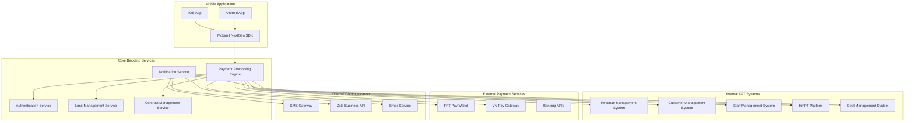
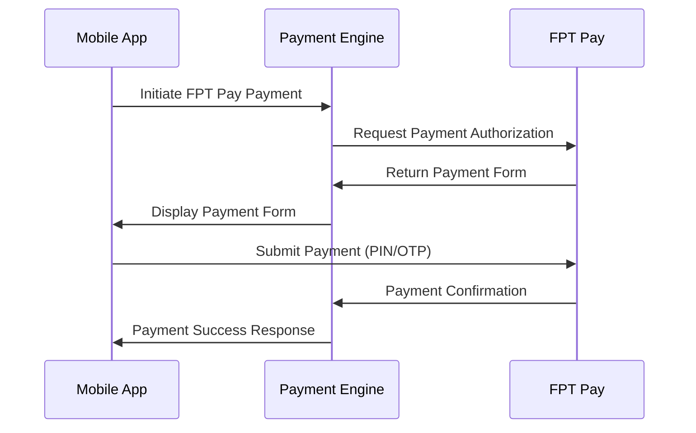
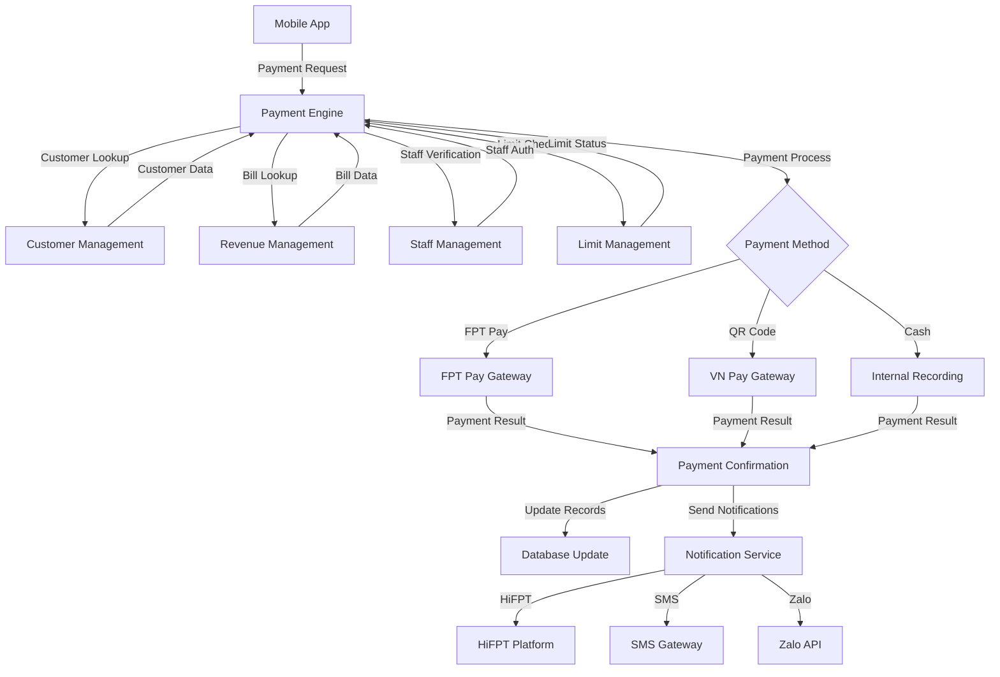
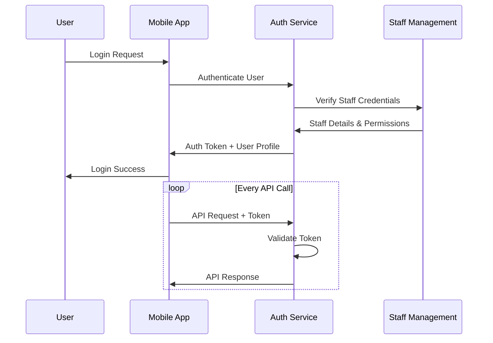

# Mobinet NextGen - System Integration Architecture

## Integration Overview

**Purpose:** Define comprehensive integration requirements for Mobinet NextGen payment system with internal and external services  
**Scope:** All system interfaces, data flows, and API specifications  
**Target:** Architecture and Database Design documentation support

## System Architecture Diagram



## Core Integration Points

### Internal System Integrations

#### 1. Revenue Management System Integration
**Purpose:** Bill and fee data retrieval  
**Data Flow:** Customer bills, payment history, outstanding balances

```
API Endpoints:
- GET /api/bills/{contract_number}
- GET /api/fees/{contract_number}  
- GET /api/payment-history/{contract_number}
- POST /api/payments/record

Data Format:
{
  "contract_number": "SGFDN1015",
  "bills": [
    {
      "bill_number": "U23SG0073526",
      "period_from": "2025-06-01",
      "period_to": "2025-06-30", 
      "amount": 200000,
      "content": "Cước Internet 2025-06",
      "issue_date": "2025-07-01",
      "status": "unpaid"
    }
  ]
}
```

#### 2. Customer Management System Integration
**Purpose:** Customer data and contract information  
**Data Flow:** Customer details, phone numbers, contract status

```
Customer Data Structure:
{
  "customer_id": "CUST_001",
  "contract_number": "SGFDN1015",
  "name": "Nguyen Van A",
  "phone_numbers": [
    {
      "number": "0987654321",
      "type": "primary",
      "has_hifpt": true,
      "is_messaging": true
    }
  ],
  "contract_status": "active",
  "service_address": "123 ABC Street, District 1"
}
```

#### 3. Staff Management System Integration
**Purpose:** Staff authentication and payment limits  
**Data Flow:** Staff credentials, payment limits, role permissions

```
Staff Authentication:
{
  "staff_id": "NV001",
  "role": "TIN_PNC",
  "payment_limits": {
    "daily_limit": 10000000,
    "per_transaction_limit": 5000000,
    "used_today": 2000000
  },
  "permissions": ["payment_processing", "reason_management"]
}
```

### External Payment Gateway Integrations

#### 1. FPT Pay Wallet Integration
**Purpose:** Digital wallet payment processing  
**Flow:** Staff wallet-based customer payments



**API Specification:**
```
FPT Pay Integration:
- Endpoint: https://api.fptpay.vn/payment/init
- Method: POST
- Headers: {
    "Authorization": "Bearer {staff_token}",
    "Content-Type": "application/json"
  }
- Payload: {
    "amount": 200000,
    "description": "Payment for contract SGFDN1015",
    "customer_info": {
      "name": "Nguyen Van A",
      "phone": "0987654321"
    }
  }
```

#### 2. VN Pay QR Code Integration
**Purpose:** QR code payment generation and verification  
**Flow:** Customer-initiated QR payments

```
QR Code Payment Flow:
1. Generate QR code with payment details
2. Display QR code to customer
3. Customer scans with banking app
4. Monitor payment status
5. Confirm payment completion

API Integration:
- QR Generation: POST /api/qr/generate
- Status Check: GET /api/qr/{qr_id}/status
- Payment Verification: POST /api/qr/{qr_id}/verify
```

### Communication Service Integrations

#### 1. HiFPT Platform Integration
**Purpose:** Internal messaging system for payment notifications

```
HiFPT Message Structure:
{
  "message_type": "payment_confirmation",
  "recipients": ["0987654321", "0987654322"],
  "template_id": "PAY_CONFIRM_01",
  "data": {
    "customer_name": "Nguyen Van A",
    "amount": 200000,
    "contract_number": "SGFDN1015",
    "transaction_id": "TXN_001",
    "confirmation_link": "https://fpt.vn/pay/TXN_001"
  }
}
```

#### 2. SMS Gateway Integration
**Purpose:** SMS notification delivery

```
SMS API Specification:
- Endpoint: https://sms.fpt.vn/api/send
- Method: POST
- Authentication: API Key
- Payload: {
    "recipient": "0987654321",
    "message": "Cam on ban da thanh toan...",
    "sender_id": "FPT_TELECOM"
  }
```

#### 3. Zalo Business API Integration
**Purpose:** Zalo message delivery with rich content

```
Zalo Message Template:
{
  "template_id": "M25YT02009817",
  "recipient": "0987654321",
  "parameters": {
    "customer_name": "Nguyen Van A",
    "amount": "200.000",
    "contract": "SGFDN1015",
    "date": "29/07/2025"
  }
}
```

## Data Flow Architecture

### Payment Processing Data Flow



### Authentication Flow



## API Specifications

### Core Payment API

#### Process Payment
```
POST /api/payments/process
Headers: {
  "Authorization": "Bearer {token}",
  "Content-Type": "application/json"
}
Body: {
  "contract_number": "SGFDN1015",
  "payment_method": "fpt_pay",
  "items": [
    {
      "type": "bill",
      "id": "U23SG0073526",
      "amount": 200000
    }
  ],
  "customer_phone": "0987654321",
  "notification_settings": {
    "hifpt": true,
    "sms_zalo": true
  }
}
Response: {
  "transaction_id": "TXN_001",
  "status": "success",
  "payment_url": "https://pay.fptpay.vn/...",
  "confirmation_link": "https://fpt.vn/pay/TXN_001"
}
```

#### Get Customer Bills
```
GET /api/customers/{contract_number}/bills
Response: {
  "customer": {
    "name": "Nguyen Van A",
    "contract_number": "SGFDN1015",
    "phone_numbers": [...]
  },
  "bills": [...],
  "fees": [...],
  "total_outstanding": 500000
}
```

### Notification API

#### Send Notification
```
POST /api/notifications/send
Body: {
  "transaction_id": "TXN_001",
  "channels": ["hifpt", "sms"],
  "recipients": ["0987654321"],
  "template": "payment_confirmation",
  "data": {
    "amount": 200000,
    "contract": "SGFDN1015"
  }
}
```

## Security Specifications

### API Security
- **Authentication:** JWT Bearer tokens
- **Authorization:** Role-based access control (RBAC)
- **Encryption:** TLS 1.3 for all API communications
- **API Rate Limiting:** Per-user request limits
- **Input Validation:** Comprehensive request validation

### Payment Security
- **PCI DSS Compliance:** Payment data handling standards
- **Transaction Signing:** Digital signatures for payment records
- **Audit Logging:** Complete transaction audit trails
- **Data Masking:** Sensitive data protection in logs

### Integration Security
- **Service Authentication:** Mutual TLS for service-to-service communication
- **API Keys:** Secure key management for external services
- **Network Security:** VPN/private networks for sensitive integrations
- **Monitoring:** Real-time security event monitoring

## Error Handling

### API Error Responses
```
{
  "error": {
    "code": "PAYMENT_LIMIT_EXCEEDED",
    "message": "Vượt quá hạn mức gạch nợ bằng tiền mặt",
    "details": {
      "limit": 5000000,
      "requested": 7000000
    }
  }
}
```

### Integration Failure Handling
- **Retry Logic:** Exponential backoff for temporary failures
- **Circuit Breakers:** Service isolation during outages
- **Fallback Mechanisms:** Alternative service routing
- **Queue Management:** Message queuing for critical operations

## Performance Requirements

### API Performance
- **Response Time:** < 3 seconds for data retrieval
- **Payment Processing:** < 30 seconds end-to-end
- **Throughput:** 1000+ concurrent requests
- **Availability:** 99.9% uptime during business hours

### Integration Performance
- **External API Timeout:** 30 seconds maximum
- **Retry Attempts:** Maximum 3 retries
- **Circuit Breaker:** Open after 5 consecutive failures
- **Cache Strategy:** 5-minute cache for customer data

## Monitoring and Logging

### System Monitoring
- **API Metrics:** Response times, error rates, throughput
- **Payment Metrics:** Success rates by payment method
- **Integration Health:** External service availability
- **User Activity:** Authentication and usage patterns

### Audit Requirements
- **Transaction Logs:** Immutable payment records
- **API Access Logs:** All API calls with timestamps
- **Error Logs:** Detailed error information for debugging
- **Security Logs:** Authentication and authorization events

---
*Return to [Master Analysis](./Mobinet_NextGen_Master_Analysis.md)*